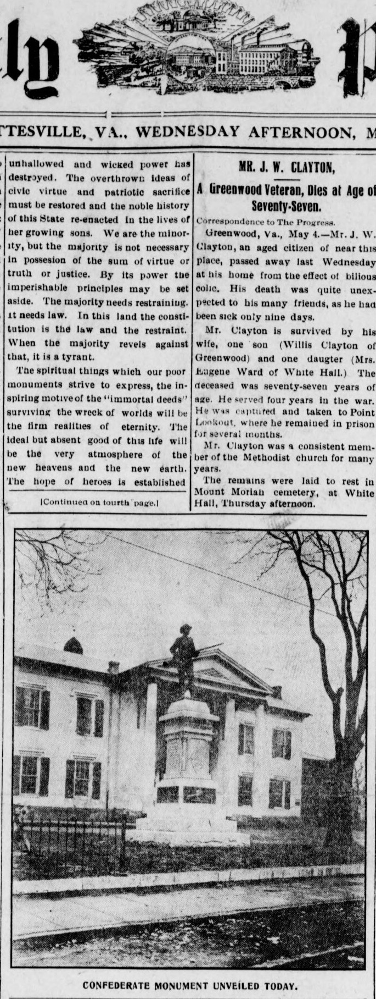

## Introduction

On May 5, 1909, the Confederate soldier memorial consisting of the statue "At The Ready" and two Napoleon cannons was dedicated in front of the Albemarle County Courthouse. This mail-order bronze statue depicts a soldier at ready, rifle raised, ready to kill to perpetuate the institution of slavery. 

## Information about the Memorial and Courthouse

Here are a few resources with detailed information about both the Courthouse and memorial:

* [Charlottesville’s Courthouse Confederate Soldier Statue](https://medium.com/@JalaneSchmidt/what-you-need-to-know-about-charlottesvilles-courthouse-confederate-soldier-f6f5e2cee5d4) by Dr. Jalane Schmidt
* ["Sculpture in and around Charlottesville: Confederate Memorials"](ACHS_Vol_48_Confederate_Memorials.pdf) by A. Robert Kuhlthau and Harry W. Webb, The Magazine of Albemarle County History, Volume 48, 1990
* ["City of Charlottesville Blue Ribbon Commission on Race, Memorials, and Public Spaces
Report to City Council, December 19, 2016"](2016BRCReport.pdf)
* "Dedication of the Monuments" chapter (p. 182) in [*Memorial history of the John Bowie Strange Camp, United Confederate Veterans...*](https://babel.hathitrust.org/cgi/pt?id=uc2.ark:/13960/t18k75981) edited by Homer Richey, including a summary of the speeches given at this monument's unveiling
* Chapter 9, A Virginia Courthouse Square in *Buildings, Landscapes, and Memory: Case Studies in Historic Preservation* by Daniel Bluestone

## Images of the Statue

Photograph from 1909 near the time of the dedication (notice cannons are not present, although they were fired at the dedication).

Photograph from 1912 by the Holsinger Studio. McKee Row can be seen on the left, an area of mostly Black residents confiscated via eminent domain in 1914 and later used for Jackson Park and the Stonewall Jackson equestrian statue.

Photograph taken circa 1939

Advertisement for "At Ready" or "At The Ready" in *Confederate Veteran* magazine, cast by the American Bronze Foundry in Chicago.  Identical statues can be found in Farmville, Va. (currently removed for public safety reasons), and in the North Carolina cities of Edenton, Fayetteville, Lexington, Louisburg, Oxford, and Shelby. 

## Contemporaneous Accounts

Below are contemporaneous accounts from *Confederate Veteran* magazine and *The Daily Progress*.

From *Confederate Veteran* magazine, May 1909

From *Confederate Veteran* magazine, August 1909

From *Confederate Veteran* magazine, October 1909

From the *Daily Progress*:

"Monument Is Unveiled Today" *The Daily Progress*, May 5, 1909. ([Original](https://search.lib.virginia.edu/catalog/uva-lib:2090743/view#openLayer/uva-lib:2090744/3286.5/2296/0/1/))

Page 1, Columns 1 & 2:

Page 1, Columns 3 & 4

Page 4

"Aftermath of the Unveiling" *The Daily Progress*, May 6, 1909. ([Original](https://search.lib.virginia.edu/catalog/uva-lib:2090752/view#openLayer/uva-lib:2090753/3290/2296/0/1/1))

*Welcome the to the Albemarle County Courthouse!*

