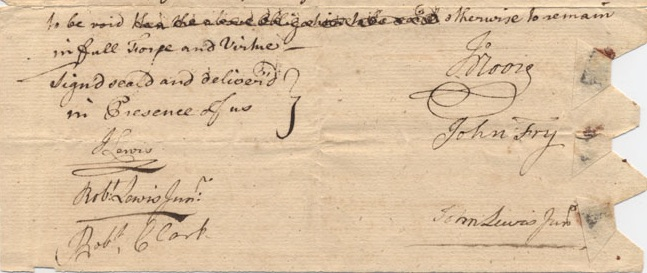

The historic Albemarle County Courthouse is a jurisdictional island -- an area less than one square block that's part of Albemarle County, but entirely surrounded by the City of Charlottesville.

For 10,000 to 18,000 years, the land the Courthouse sits on was traveled through and lived in by people we now refer to as Ancestral Monacan Society. Around 1000 CE, the ancestors of the people who now call themselves the Monacan Indian Nation formed permanent settlements in the area, most notably the chiefly village of Monasukapanough, just north of present-day Charlottesville on the North Fork of the Rivanna River. In the early 18th Century, white Anglo-American incursion, frequently violent, forced the Monacans to abandon their numerous settlements in central and western Virginia. Many migrated away from central Virginia, but there has always been an appreciable population in more isolated areas. They still live here, with many now residing near Bear Mountain in Amherst County. 

The county of Albemarle was formed in 1761, and named for Willem van Keppel, 2nd Earl of Albemarle, a former governor of the colony of Virginia. Charlottesville was chartered the next year, in 1762, to serve as a centrally-located county seat, and named for Charlotte of Mecklenburg-Strelitz, who had the year before become Queen consort of Great Britain and Ireland after her marriage to George III.

# Building

https://small.library.virginia.edu/collections/featured/the-cabell-family-papers-2/digital-archive/construction-alb-courthouse/

The land for the Courthouse was donated by Dr. Thomas Walker to the County. The construction of the original wooden Courthouse building was contracted to William Cabell. Cabell was bonded by John Fry, John Moore, and John Lewis, but was unable to complete the building, and Moore finished overseeing construction.    375L cost? but bond says otherwise.

court square enclosed in 1792. 

In 1803, the original building was replaced by a Flemish bond brick structure topped by a cupola, which is now the right rear wing of the current building. The bricks were likely made on-site, as was the typical practice of the day. Given the reliance on enslaved labor during that time, it is likely that enslaved workers were significant contributors to the construction of the building. 

served as a multipurpose space

whipping post, pillory and stocks

polling place

religious services prior to churches being built Jefferson called "The Common Temple."

1811 - brick and stone wall
1825 - brick wall disassembled, used to pave front yard
1856 - stone wall and iron railing

1859 - porch and pillars - addition towers and gables, after war removed and pediment with supporting pillars added. 

1897 - additional alterations

Slave Auctions

https://www.loc.gov/podcasts/slavenarratives/transcripts/slavery_hughes.pdf
> Selling women, selling men...all that. Then if they had any bad ones, they'd sell them to the nigga traders, what they called the nigga traders. And they'd ship them down south, and sell them down south. But, otherwise if you was a good...good person they wouldn't sell you. But if you was bad and mean and they didn't want to beat you and knock you around, they'd sell you...to the, what was called the nigga trader. They'd have a regular...have a sale every month, you know, at the courthouse. And then they'd sell you, and get two hundred dollar...hundred dollar...five hundred dollar. -- Fountain Hughes

https://en.wikipedia.org/wiki/Maria_Perkins_letter

>Dear Husband I write you a letter to let you
know of my distress my master has sold albert to a trader
on monday court day and myself and other child is for sale also
and I want to you let hear from you very soon before
next [court] ... I dont want a trader to
get me.. they asked me if I had got any person to buy me
and I told them no they took me to the court houste too they
never put me up ... I am and ever will be your kind Wife Maria Perkins 

https://medium.com/@JalaneSchmidt/humans-were-sold-here-e326e28b03ad

Ledger from the 1829 Thomas Jefferson estate sale of 33 people at Eagle Tavern.

KKK meetings

Klan Speaker Well Received https://search.lib.virginia.edu/catalog/uva-lib:2590289/view#openLayer/uva-lib:2590290/3026/2689/3/1/1

Jefferson, Madison and Monroe were frequent visitors?

Eagle Tavern sale of Monticello after Jefferson's death

In 1859 a front addition was constructed in the Gothic Revival style, with octagonal stair towers flanking the entrance. 

During the 1870’s, the portico, with its grand columns, was added, while as late as 

1938 a WPA project remodeled the building to create uniformity with the earlier classical style.

historic register

104-0072 Charlottesville and Albemarle County Courthouse Historic District 
https://www.dhr.virginia.gov/historic-registers/104-0072/

104-0057 Albemarle County Courthouse Historic District 
https://www.dhr.virginia.gov/historic-registers/104-0057/

# Monuments and Memorials

## Jack Jouett

Jack Jouett Q-17 1998
https://vcris.dhr.virginia.gov/HistoricMarkers/

## Monticello

Monticello W-200 1928
https://vcris.dhr.virginia.gov/HistoricMarkers/

Three miles to the southeast. Thomas Jefferson began the house in 1770 and finished it in 1802. He brought his bride to it in 1772. Lafayette visited it in 1825. Jefferson spent his last years there and died there, July 4, 1826. His tomb is there. The place was raided by British cavalry, June 4, 1781 
Conservation & Development Commission, 1928

## John Henry James Lynching

## At The Ready (1909) Confederate Soldier Statue

1909 - 10 year effort culminates in Conf Soldier Monument

Confederate Soldier Memorial -- same year of disenfranchising VA Constitution

May 5, 1909 Confederate Monument at Albemarle County Courthouse unveiled.
Micajah Wood, then Albemarle Commonwealth's Attorney and ... was the chair. List members of committee. 

“Monument Is Unveiled Today”Daily Progress, May 5, 1909, page 1 http://search.lib.virginia.edu/catalog/uva-lib:2090743/view#openLayer/uva-lib:2090744/4722.5/1828/2/1/0 

# Thomas Jonathan Jackson statue (1921)

https://en.wikipedia.org/wiki/Thomas_Jonathan_Jackson_(sculpture)

## DAR TJ

## Meriwether Lewis memorial memorial

## McKee Row & John West

## References

* Albemarle County in Virginia by Edgar Woods