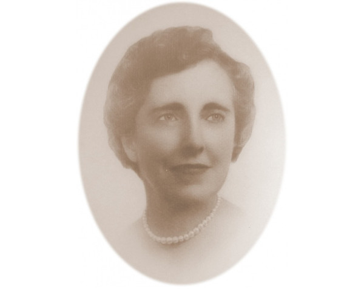
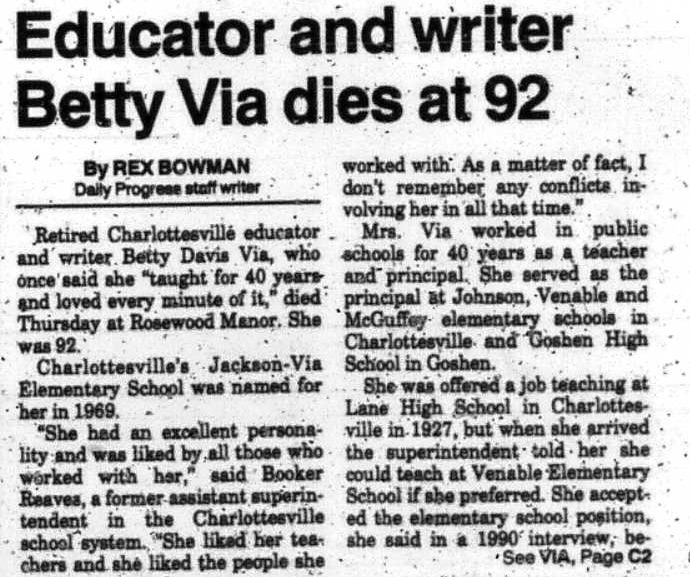
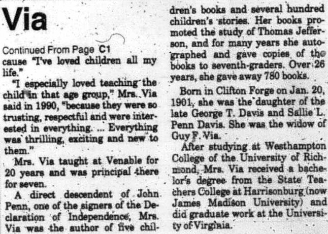

Jackson-Via Elementary is named for ​​[Nannie Cox Jackson​](../nannie-cox-jackson)​ and ​Betty Davis Via​. The school was formed in 1969 and moved to the current building in 1970. Jackson-Via was the city’s first school planned and built as an integrated school, thus being dually-named for both a Black educator, Jackson, and a white educator, Via.

Betty Davis Via (1901-1993)​ was an educator in the city schools from 1927 to 1965. She taught at Venable Primary until becoming principal in 1945. She became the first principal of Johnson Elementary when it opened in 1955, working there for 10 years, including during the desegregation of the school in 1962.

Via was born in Clifton Forge, Virginia. She was a descendant of [John Penn](https://www.dsdi1776.com/signers-by-state/john-penn/), a signer of the Declaration of Independence who also enslaved Black people, and, through Penn, was a member in the Daughters of the American Revolution.  She received her Bachelor's degree from State Teachers College at Harrisonburg, which would later become James Madison University. 

Celebration of the Confederacy was ingrained part of white education during Via's career. In 1936, Via wrote an article "The Venable Spirit" for Superintendent James G. Johnson's *History of Venable* while she was a civics and history teacher at the school. She writes:

>Look about as you enter. Shafts of sunlight fall upon a picture of the immortal Lee and you immediately recall his watchword of "duty" which is a part of every Venable child's honor code. Near Lee is the picture of Colonel Venable for whom our school was named, a man who lived "a life that lifted other lives to higher planes of thought a purpose." Across from this portrait is the ever-inspiring picture of our own Jefferson who planned and built Virginia's University, hoping that down through the years each young man of his state privileged to attend there would "study to show himself approved unto God, a workman that needeth not be ashamed." Worthy of a place in any group of the eminent sons of Virginia, there also hangs a fourth portrait, that of Dr. Thomas Leonard Watson, Professor of Geology in the University of Virginia...  
>...    
>The spirit of our school was formed back through the years by these and similar great leaders, who inspired many a youth to become a seeker of truth.  
>...    
>Every Venable boy and girl remembers the thrill of seeing the first movie shown by our own projector.  This picture was entitled "Dixie", one of the historical series, "Yale Chronicles of America"...

Via was principal of Johnson Elementary when it was desegregated by Federal court order.  At the 2019 commemoration of this event, Rosalind Whitlock, one of the first Black students to enter Johnson, recounted this story:

>During my first couple days at Johnson, I felt isolated as no one really... as no one sat with me at the lunch table, and that was okay. I was subjected to a short instance of bullying, and after I mentioned that to my parents, they accompanied me to school the very next day, went straight to the principal's office, and from that point on I never ever again encountered any other difficulties throughout my education in the Charlottesville City School system. 

Via wrote several children's books, including ​*Monticello Scrapbook* (​1938), *Young Tom Jefferson's Adventure Chest​* (1942), ​*Scotchtown Tale​* (1946), *Monticello's Animal Kingdom​* (1967)​, *Thomas Jefferson and The Indians* (1969)​, and ​*Sunshine and Shadows over Little Mountain* (​1982), and numerous children's stories, including ​*The Fourth-of-July Goose: A Monticello Story*.

Her books frequently perpetuate the "happy slave" myth; they refer to enslaved people simply as "servants,"; they use racist archetypes for Indigenous and African American characters (e.g., "grinning negro boy", "old Mammy"); they use an imagined dialect for the dialogue of those characters; and they use what we now consider racial slurs, such as "negro," "Injuns," "redskin," and "squaw."

Her book ​*Young Tom Jefferson's Adventure Chest*​ contains passages such as the following:
>"'Marse Tom,' he gasped. 'Look at dis here. I heered a bobwhite call and den it come flyin' through de air and stick right in a stump near de woodpile whar I'se asittin'. Marse Tom, it's Injuns. Is we gwine to be attacked?'"​ (p. 178)

In the preface of ​Monticello Scrapbook​ (1938), Via states:

>The events included in the Monticello Scrapbook are historically authentic. In order to make the stories more alive I have in some cases related what the characters might have said and described the reactions which they might have experienced to well known situations.

The following is a selection from the story "Home Again" in ​Monticello Scrapbook,​ describing Thomas Jefferson's return to Monticello after having served as a diplomat in France. It was around this time that Jefferson engaged with Sally Hemings.

Here is a selection from "Home Again," ​Monticello Scrapbook:​

>It was the day before Christmas eve, 1789. For weeks there had been great Christmas preparations at Monticello. Pudding and frosted cakes had been made. Every room had been dusted and polished until the beautiful furniture and floors fairly shone. The children of the servants had made holly wreaths for the windows and hauled pine logs for the fireplaces. Bright turbans and gay aprons had been made ready and now they were donned in great excitement. For weeks the word had passed around "Marster's comin'," "Marse Tom's comin'!" "Miss Martha and Miss Mary's comin'!"  
>  
>And at last the day had arrived and Mr. Jefferson and his two daughters were returning home after an absence of Europe of five years.  
>  
>Mr. Jefferson had written to his overseer the news of his return and the overseer had told the negroes. Upon their request the 23rd was declared a holiday in honor of the master's home coming and all of them had gathered from Mr. Jefferson's farms. No one wanted to miss the happy event. Old and young, women and children gathered on this hillside. Singing and shouting and calling to each other, they grew impatient with waiting and walked down the mountain to meet the carriage-and-four at Shadwell, Mr. Jefferson's birthplace. Eagerly they vied with one another to be the first to see the beloved face. How they cheered and cried and sang when they saw him! Crowding around the carriage they tried to touch his hands or feet or even his coat. Smiling, the master greeted them heartily, calling each by name. In the merry confusion, they unhitched the horses and lining up beside the carriage pole, pulled it themselves up to the beautiful portico of Monticello. One by one they quieted down. Many an eye was moist with memories of other days when Mr. Jefferson had brought his bride to Monticello.  
>  
>"Miss Martha done growed up, bless de Lawd," exclaimed an old Mammy standing near, "An' look at Miss Mary, ain't she beautiful?" called out another. And Maria, now in her 11th year, was more beautiful and lovable than ever. Martha was a tall and stately young lady of seventeen.  
>  
>Their charm and beauty and lovely French clothes overawed the servants, and they fell back to let them enter. Up the front steps the master went with a beloved daughter on each arm, and Martha Jefferson walked across her father's threshold knowing that she would be more than ever his companion and the mistress of Monticello.

In the 1993 Daily Progress article following Via's death, she was praised by Booker T. Reaves, long-time principal of the all-Black Jefferson School and the first African-American Assistant Superintendent and Acting Superintendent of Charlottesville City Schools.

>She had an excellent personality, and was liked by all of those who worked with her. She liked her teachers and she liked the people she worked with. As a matter of fact, I don't remember any conflicts involving her in all that time.

## Resources

* [Cvillepedia - Betty Davis Via](https://www.cvillepedia.org/Betty_Davis_Via)
* The Daily Progress, Aug 21, 1993, "Educator and writer Betty Via dies at 92"
* Davis, Betty Elise (Via) *Monticello Scrapbook*
* Davis, Betty Elise (Via) *Young Tom Jefferson's Adventure Chest*
* Johnson, J. G., *​Education Pamphlets: Vol. 3.​ 1936. History of McGuffey school, 1915-1936. History of Venable school, 1922-1936. History of George Rogers Clark school, 1928-1936.*