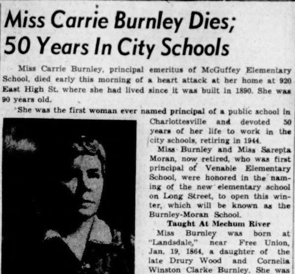
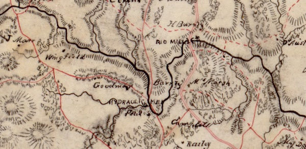
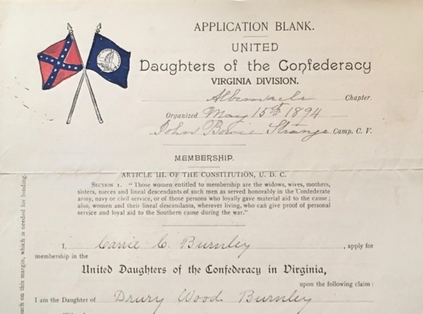
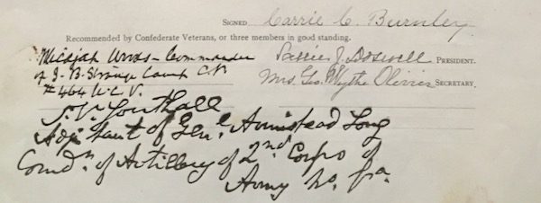
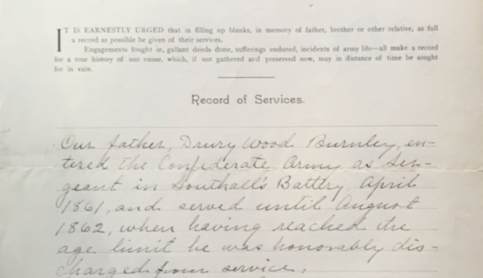
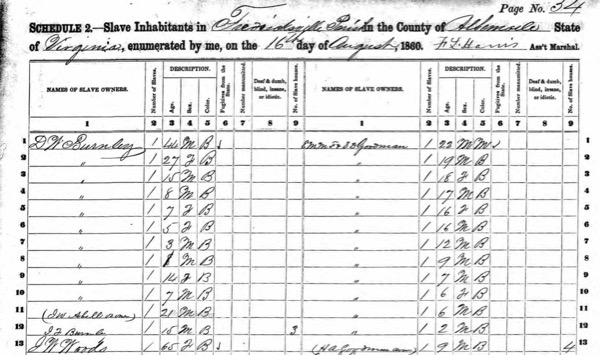
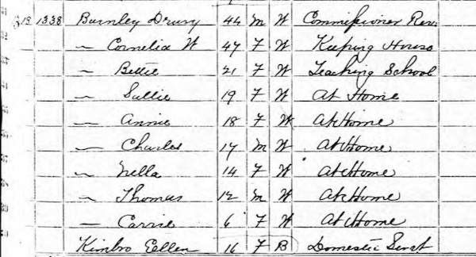
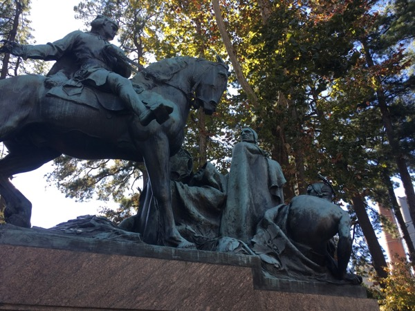
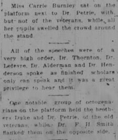

## Introduction

Burnley-Moran Elementary opened in the fall 1954 as a white-only elementary school. It was named dually-named for  the first two female principals in Charlottesville public schools, Carrie Burnely at McGuffey School and Sarepta Moran at Venable School, and both also being the heads of those schools when they opened.

The decision *Brown v. Board of Education of Topeka*, which overturned the "separate but equal" doctrine of school segregation, was overturned in May of 1954, and the next year saw the *Brown II* addendum ordering desegregation "with all deliberate speed."  It would not be until 1959 that any school in Charlottesville was desegregated, then via Federal court order after being shutdown by Virginia Governor J. Almond Lindsey as part of "Massive Resistance", and 11 years until all schools were integrated.  It is within this context that the a new elementary school for white children in the northeast part of the city was named for two women who had made significant contributions to the education of white children in Charlottesville and were active members of the United Daughters of the Confederacy.

## Early Life and Family

**Carrie Cornelia Burnley​ (1864-1954)** was born in Albemarle County at "Landsdale" near Free Union, Virginia. She was one of five children born to Cornelia Winston Clarke and Drury Wood Burnley.  Burnley was first cousin to notorious Charlottesville benefactor Paul G. McIntire, through her maternal aunt, Catherine (Ann) Clarke McIntire.  
Burnley's grandfather, Nathaniel Burnley (1786-1860), owned [Hydraulic Plantation](http://www.centralvirginiahistory.org/hydraulic.shtml) in the Hydraulic Mills area just north of Charlottesville and for which Hydraulic Road is named. Among the more than 225 people the family enslaved there was ​[Fountain Hughes](https://www.monticello.org/getting-word/people/fountain-hughes), famous for his 1949 interview, one of the few extant audio interviews with a formerly-enslaved person.

(*Map of Hydraulic Plantation owned by Nathaniel Burley*)

## Career

For 50 years of her 61-year career as an educator, Carrie Burnley taught at both the elementary and high school levels in Charlottesville. Burnley began teaching in 1883 at age 19 at "White School Number 8", a one-room schoolhouse near Mechums River in Albemarle County. She then taught in Harrisonburg schools before teaching privately in Charlottesville. In 1894, she taught seventh grade in the inaugural year at the new Midway School. She later became assistant principal of the grammar division at Midway and, in 1911, moved to the high school division to teach science and math. In 1916, she became the first female principal in the district at the new McGuffey primary school, and held that position for 28 years until her retirement in 1944 at age 80.

## United Daughters of the Confederacy

(*Carrie Burnley UDC Application, Special Collections, University of Virginia Library*)

Burnley was a member of the Albemarle Chapter of the United Daughters of the Confederacy (UDC), joining in 1907. The UDC was one of the most effective organizations at propagating the ["Lost Cause" myth](https://www.encyclopediavirginia.org/lost_cause_the), which sought so present an ahistorical view that the Civil War was not about the economic interest of slavery and the political interest of white supremacy.  The Albemarle chapter was instrumental in erecting several Confederate monuments in downtown Charlottesville, including the statue ​*At the Ready* at the Albemarle County Courthouse, the *Robert Edward Lee​* equestrian statue, and the *T​homas Jonathan Jackson* ("Stonewall Jackson") statue. 

One of the most notorious tactics of promoting the Lost Cause revision of factual history was through the [writing and selection of school textbooks](https://www.encyclopediavirginia.org/United_Daughters_of_the_Confederacy#its3). First as a teacher and later as principal, Burnley held a uniquely effective role in this historical activism. For example, while principal of McGuffey, she began a tradition of students decorating the Lee and Jackson monuments with flowers.  

In a speech given at her retirement, her early life in the context of post-Civil War Virginia is given:

>Her earliest memory was of the river and boat, a picnic ground across the river, and the quarters where the slaves had lived.  The family moved to "Rio" on Rivanna River when she was four years old.  She never tired of hearing her older sisters, Bettie and Sally, tell how the "Yankees" came in 1865 and burned the mills and bridge at "Rio", the home there lying between the Confederate and Federal lines during the "Battle of Rio".

The story of the "Battle of Rio" (actually in 1864, rather than 1865) is recounted in more detail by Burnley's sister, Sallie Burnley, in *Confederate Veteran* magazine, October 1923 ([PDF](sallie_burnley_battle_of_rio_cv_oct_1923.pdf)).

Burnley was considered a "true daughter" of the Confederacy by the UDC, as her father, Sergeant Drury Wood Burnley, served in the Confederate States Army from April 1861 until August 1862 as a member of the Albemarle (Virginia) Light Artillery, also known as Southall’s Battery. This unit was founded and commanded by Captain William Henry Southall (1826-1890), brother of Mary Southall Venable, who later served as chair of the committee overseeing the erection of the Confederate memorial statue *​At the Ready​* at the Albemarle County Courthouse in 1909. Mary Southall was was widowed after her husband, J. Thompson Brown, a Confederate artillery officer, was killed at the Battle of the Wilderness, then married [Col. Charles S. Venable](../charles-venable), aide-de-camp to Gen. Robert E. Lee, UVa professor, and namesake of Venable Elementary.  Another of Mary Southall Venable’s brothers, S. V. Southall, was one of the Confederate veterans who endorsed Burnley’s application to the UDC.

In her membership application to the UDC, Burnley discusses her father's military service:

>Our father, Drury Wood Brunley, entered the Confederate Army as Sergeant in Southall's Battery, April 1861, and served until August 1862, when having reached the age limit he was honorably discharged from service. General John B. Magruder was his commanding general. He told us many incidents of army life and of sufferings endured, which while deeply interesting to us, have been told and retold so often in the experience of other Confederate soldiers that it is needless to repeat them here. Most of his army life was spent on the Peninsula. We give a brief extract from a letter written to one of his children, while stationed there-  
>  
>>Ship Point, York Co. Va. , Sunday, October 27 1861  
>>  
>>"We have moved and moved and moved until I find myself away down on Ship Point in York County surrounded on three sides by water, just where the Poquosin River, York River, and Cheesemans's Creek empty themselves into Chesapeake Bay, about ten or twelve miles below Yorktown. We were ordered here last Sunday night about two oclock without tents, and with but one blanket, and of course are sleeping quite coolly as it has been raining for four days since we have been here, and there are no houses. We have been living very hard in the eating line, having no meat except entirely fat mess pork, which you may cut up in right large slices, and when fried turns out nothing but a little crackling about as large as your little finger, and the nearest fresh water is about 3/4 mile off. We heard that the enemy had left Fortress Monroe with about fifty ships of war and that seven of that number were destined for this place, and we have been waiting and sleeping with both eyes open looking for the Yankees ever since, but we have not seen them yet except at a distance of five or six miles off the bay, which is too far for our guns - we see a good many Yankee boats off in the bay, beside the blockading vessels which we see constantly. Two of our guns are here under command of Lieut. Watson, and the balance of our guns are at Yorktown. We are under the command of Col. Sulakowski, who is a Pole. We have about 500 men and three small guns besides our two, and are attempting to command one of the most important points on the peninsula. If the Yankees had a bit of pluck they could come here and whip us with all ease, and it is just so all over the peninsula. This is the most quiet Sunday that I have seen since I have been in the army. nothing to disturb the Sabbath except a little target shooting, and a band of music.

In the 1860 Federal census, D. W. Burnley is listed as owning 10 slaves and holding two others. 

(*Drury Wood Burnley, Slave Inhabitants in Fredricksville Parish in the County of Albemarle State of Virginia, 1860*)

Carrie Burnley was not born until 1864, so she first appears on the 1870 census, when her father was then Commissioner of Revenue and her oldest sister was a teacher. 

(*Drury Wood Burnley household, 1870 Federal census*) 

In 1921, the statue *George Rogers Clark* was dedicated, a gift to UVA from her cousin Paul G. McIntire.  This statue depicts the brutal subjugation of Native Americans by the US government, and was intended to be physical representation of the continuing belief in white supremacy behind the Jim Crow era of racial terror at that time.  

The Daily Progress describes the dedication ceremony, mentioning Carrie Burnley specifically: 

> Miss Carrie Burnley sat on the platform next to Dr. Petrie, with but not of the veterans, while all her pupils swelled the crowd around the stand. 
>
>All of the speeches were of a very high order, Dr. Thornton, Dr. Lefevre, Dr. Alderman and Dr. Henderson spoke as finished scholars only can speak and it was a great privilege to hear them.
>
>One notable group of octogenarians on the platform held the brothers Duke and Dr. Petrie, of the old veterans, while Dr. F. H. Smith flanked them on the opposite side.

The "brothers Duke" mentioned are William Richard Duke and Judge R. T. W. Duke, Jr., a [major proponent of the Lost Cause](https://news.virginia.edu/content/uva-and-history-race-lost-cause-through-judge-dukes-eyes).  Dr. Thornton is [William M. Thornton](https://explore.lib.virginia.edu/exhibits/show/hoos/fabled-faculty/william-m--thornton), for whom Thornton Hall is named, the main building of the School of Engineering and Applied Science at UVa. Dr. Alderman is [Edwin A. Alderman](https://www.encyclopediavirginia.org/alderman_edwin_anderson_1861-1931), first president of UVa and for whom Alderman Library is named, and who gave the acceptance speech of the Robert E. Lee equestrian statue on behalf of the white residents of Charlottesville, another gift to the city from Burnley's cousin Paul G. McIntire.

## References

* Papers related to Carrie Burnley's retirements in [PDF](carrie_burnley_retirement.zip) or [zip](carrie_burnley_retirement.zip), from United Daughters of the Confederacy, Virginia Division, Papers, Accession #11331, Special Collections Department, University of Virginia Library, Charlottesville, Va. 
* United Daughters of the Confederacy, Virginia Division, Papers, Accession #11331, Special Collections Department, University of Virginia Library, Charlottesville, Va. 
* The Daily Progress, Sept 17 1954, Miss Carrie Burnley Dies; 50 Years in City Schools.
* [The Lost Cause, Encyclopedia Virginia](https://www.encyclopediavirginia.org/lost_cause_the)
* [United Daughters of the Confederacy, Encyclopedia Virginia](https://www.encyclopediavirginia.org/United_Daughters_of_the_Confederacy)
