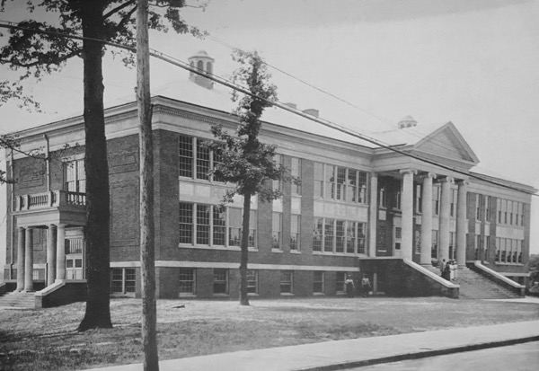
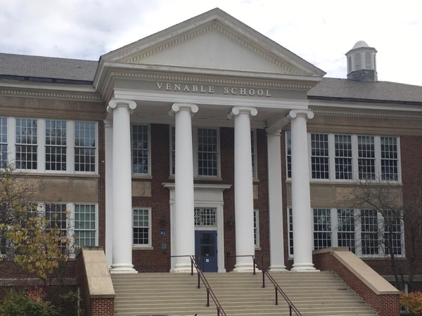
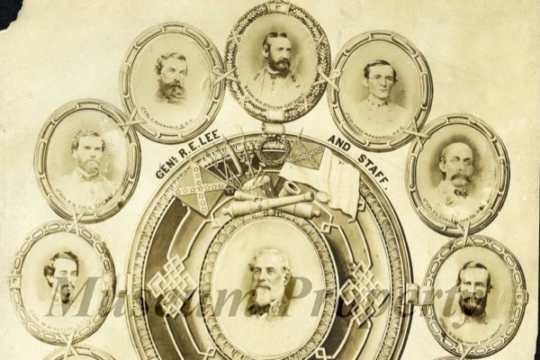
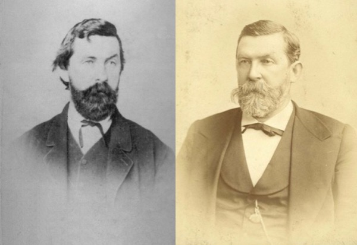
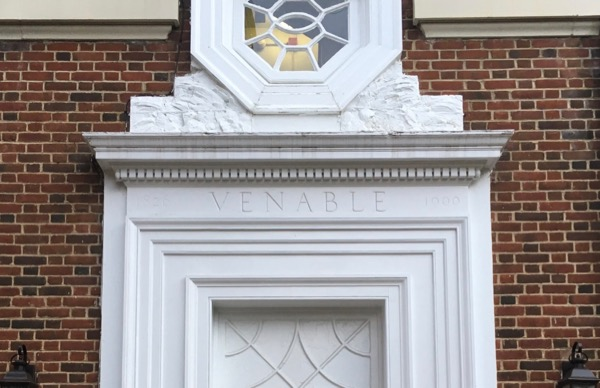
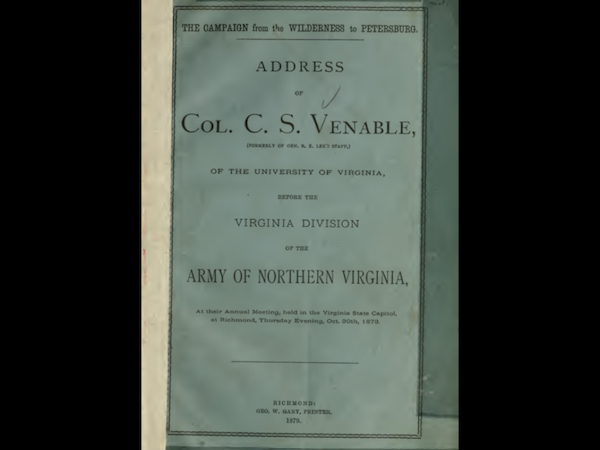
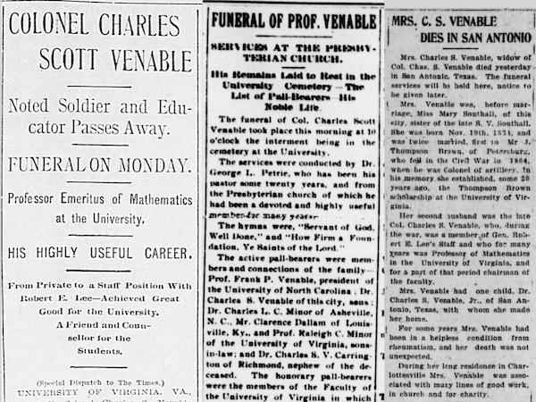

## Introduction

from *History of Venable School 1922-1936* by Johnson and Moran, 1936. captioned: *This picture of Venable School was taken on the morning of July 1, 1925.  The individuals on the front steps reading left to right are: James G. Johnson, Superintendent of Schools, Miss Carrie C. Burnley, Principal of McGuffey School, Miss Sarepta A. Moran (who has just been installed as Principal of Venable School), and Miss Frances Jones, Secretary to the Superintendent.*

*Venable Elementary in 2019*

Venable Elementary School was opened in 1925 in what is now the Venable neighborhood of Charlottesville, Virginia, as the primary school for white students living on the west side of the city. The school's namesake, Charles S. Venable, has since fallen into obscurity, so that even those parents with students in the school would be hard-pressed to come up with his name or why the school was named for him.

This is the somewhat-obscured description on the Charlottesville City Schools website:

> The school was named for Colonel Charles Scott Venable, who was a Civil War soldier, professor of mathematics at the University of Virginia and author of arithmetic books for children.  
> [About Venable Elementary School](http://charlottesvilleschools.org/venable/us), 

Venable wasn't just "a" Civil War soldier. He played an instrumental role as a Confederate officer, serving as an aide-de-camp to ["the most heroic and saintly of all Confederates"](https://www.encyclopediavirginia.org/lost_cause_the#its1) Robert E. Lee, spending three years of the war either consulting with Lee or performing tasks directly assigned by him.  He then parlayed this close association with Lee, including a personal letter of recommendation from him, into a professorship at UVa.  

*[Military Medallion: Robert E. Lee and Staff](https://moconfederacy.pastperfectonline.com/photo/FEA8F479-B82D-471A-85AC-306041763881), "Lt Col C. S. Venable A. D. C." in 11 o'clock position, from the collection of the [American Civil War Museum](https://acwm.org)*

Throughout his life, he actively supported the institution of slavery, enthusiastically fought in the war to preserve it, afterwards promoted [The Lost Cause](https://www.encyclopediavirginia.org/lost_cause_the) myth that sought to recast the Civil War as something other than primarily to uphold slavery, and proudly made clear his racist beliefs throughout his life.

>[Venable] derided the idea of giving freedmen the vote, expressing thanks that Virginia had escaped the **'black dominion'** of military Reconstruction, and derided the idea of blacks attending the University of South Carolina as **'the Fetish of abolitionists.'** Finally, he summarized Reconstruction itself as **'the cruel crotchets of a sentimental philanthropy.'**  
>  
> from *Sacrificing for the Lost Cause* by Robert W. Sidwell

## Early Life 

[Charles S. Venable](https://www.encyclopediavirginia.org/Venable_Charles_S_1827-1900) was born in Farmville, Virginia in 1827 into a prominent family.  His immediate family and direct ancestors owned several large plantations throughout Virginia that relied on enslaved labor. 

Among those with the Venable in his direct line, there are his:

* son, [Francis P. Venable](https://www.wikitree.com/wiki/Venable-362), graduate of UVa in 1876. In 1900, F. P. became the president of The University of North Carolina after the resignation of Edwin A. Alderman, who, in 1904, became the first president of UVa.
* father, [Nathaniel E. Venable](https://www.wikitree.com/wiki/Venable-9), captain in a militia during the War of 1812, inherited Longwood Plantation from an uncle, where Longwood University is now
* grandfather, [Col. Samuel Woodson Venable Sr.](https://www.wikitree.com/wiki/Venable-3), an officer in Captain Watkins' Dragoons, under Major-General Henry "Light-Horse Harry" Lee III (father of Robert E. Lee) during the Revolutionary War, and considered a founder of Hampden-Sydney College, inheritor of Slate Hill Plantation in Prince Edward County, Virginia.
* great-grandfather, [Colonel Nathaniel E Venable I](https://www.wikitree.com/wiki/Venable-50) - Revolutionary War officer, organizer of the Slate Hill Plantation, during his lifetime owned 20-30,000 thousand acres and over 100 slaves 
* great-great-grandfather, [Captain Abraham Venable II](https://www.wikitree.com/wiki/Venable-46) - captain in a colonial militia, owned significant amounts of land and numerous slaves, some of whom are named in his will
* great-great-great-grandfather, [Abraham Venable I](https://www.wikitree.com/wiki/Venable-45) - a surgeon in the first regiment of British troops sent to Jamestown, under Sir John Harvie, received a land grant from Charles II

Charles S. Venable first received an AB degree at Hampden-Sydney College at the age of 15, then matriculated from the University of Virginia in 1845. He proceeded to teach at Hampden-Sydney College, the University of Georgia, and the South Carolina College before joining the Confederate cause. 

## War Years

In 1861, he was a professor at South Carolina College (now University of South Carolina).  He joined the Congaree Mounted Rifles militia and encouraged his students leave college and join Confederate military units. As part of this militia, he was present in 1861 at the Battle of Fort Sumter, the first military engagement of the Civil War.  Venable soon became an officer in the newly-formed Confederate States Army, then served as aide-de-camp in the small personal staff of Gen. Robert E. Lee from 1862 until surrender in 1865. From then on he styled himself with the honorific "Colonel," instead of "Professor" or "Doctor."

*(Venable Portal, Brown College at Monroe Hill, UVa)*

Primarily because of his association with Lee, including a personal letter of recommendation from him, Venable was offered a position as a Professor of Mathematics at the University of Virginia. According to Sidwell, "the trustees selected Venable as professor of mathematics largely to spite the university's Federal occupiers, whose preferred candidate had not served in the Confederate army". Venable taught at UVa for the next 30 years, and served as Chairman of the Faculty for several years during that time. He wrote a number of mathematics textbooks which were adopted in Virginia primary schools, including the white schools in Charlottesville, and served on the Charlottesville School Board for six years. 

*(The Campaign from the Wilderness to Petersburg, Address of Col. C. S. Venable, Formerly of R. E. Lee's staff, of the University of Virginia, before the Virginia Division of the Army of Northern Virginia, 1878)*

After the Civil War, as secretary of the Association of the Army of Northern Virginia, Venable was an ["important voice among those promoting the Lost Cause interpretation of the Civil War,"](https://www.encyclopediavirginia.org/Venable_Charles_S_1827-1900) which ["sought to discount the importance of slavery and emphasize the valor of Confederate soldiers."](https://www.encyclopediavirginia.org/Venable_Charles_S_1827-1900) The Lost Cause also gave rise to the era of racial terror known as Jim Crow, the miseducation of generations, and the perpetuation of the myth of white racial supremacy. 

In 1882, former Governor of South Carolina and then-Senator [Wade Hampton](https://en.wikipedia.org/wiki/Wade_Hampton_III) offered Venable the presidency of the University of South Carolina primarily due to his Confederate sympathies, the two having known each other personally from serving in Lee's Army of Northern Virginia(personal letters from Charles Venable papers, as cited by Sidwell).

*C.S. Venable obituary (Richmond Times), funeral report (Daily Progress), and Mary Southall Venable obituary (Daily Progress)*

When Venable died in 1900, he was so revered among white Virginians that his obituary was not only published on the front page of the local Daily Progress, but also the front page of the Richmond Times.  The next day, the Daily Progress also published a front page article on his funeral.  When his second wife, Mary Southall Venable, passed, her obituary was also published on the Daily Progress front page. She herself was from a prominent local family involved Confederate cause, and had served as the chair of the committee that erected the Confederate soldier statue in Charlottesville's Court House Square.

## Quotations by or about Venable

The following quotations by or about Venable come from Robert Sidwell's dissertation *Sacrificing for the Lost Cause: General Robert E. Lee's Personal Staff*, and are representative of Venable's beliefs.

From *Mary Chesnut's Civil War* by 	Mary Chesnut and C. Vann Woodward (ed.):

>Whiling away long hours conversing with States Rights Gist, James and Mary Chesnut, and other notables, Venable often expressed both his disgust at the northerners who were waging war against **'Christian' slavery** and those who sought commissions in the Confederate army behind the lines.  

From *Memoir* by F. P. Venable, Barbour Family Papers, and Charles S. Venable Papers:

>[By 1867], he proposed a curriculum change to make the mathematics program more flexible, and staunchly opposed any attempt to open the university [of Virginia] to black students.

From the Charles S. Venable Papers:

>Similarly, although Charles Venable felt the necessity of preserving heroic memories of the Confederacy, he was too preoccupied with personal and professional matters to participate in most public efforts to promote the 'Lost Cause.' He continued to correspond with other former Confederate officers... and joined local historical associations to promote Confederate memory, writing that, 'I esteem highly the work of such societies in collecting and preserving the materials for local and state histories.'

## Venable Elementary School

When Venable Primary School was named in late 1924, the existing, segregated public schools in Charlottesville were:

* Midway School - white, grades 1-11. Named after Alexander Garrett's former plantation house, which sat nearby, and where he enslaved more than 60 Black people
* McGuffey Primary School - white, grades 1-7, named for [William Holmes McGuffey](https://en.wikipedia.org/wiki/William_Holmes_McGuffey) in 1916, a professor of Philosophy at UVa, who wrote the McGuffey Readers, “the first widely used series of elementary school-level textbooks... [selling] more than 120 million copies... between 1836 and 1960.”
* Jefferson Colored School - Black, grades 1-7, named for Thomas Jefferson

At the October 16, 1924 Charlottesville School Board meeting, the three-man naming committee recommended naming the new school "Venable" by a vote of 2-1, with one of the yes votes coming from Dr. Thomas L. Watson, Professor of Geology at UVa. Both Watson's father, Fletcher B. Watson, and uncle, Wilbur F. Watson, served in the Virginia 6th Cavalry Regiment, Confederate States Army. 

As relayed in The Daily Progress the next day, "Mr. Paul G. McIntire spoke in favor of honoring the name and work of Col. Charles S. Venable by naming the new school for him." McIntire's support for naming the school for Venable is aligned with this other instances of Confederate memorialization, such as the statues *Robert Edward Lee* and *Thomas Jonathan Jackson*, and white supremacist memorialization in general, through the statues *Their First View of the Pacific* (depicting a submissively postured Sacajawea beside Lewis & Clark) and *George Rogers Clark* (depicting the "conquering" of Native Americans). 

The next month, at the Nov. 20, 1924 Charlottesville School Board meeting, the Board voted 7-3 to name the new school "Venable Primary School." Watson died several days before the meeting, and was therefore unable to finally vote for that name.  At the same meeting, the Board also voted to rename Midway High to Lane High, for James W. Lane, long-time principal of Midway.  

Celebration of the Confederacy was a regular part of the school system during that time. In 1936, Betty Davis Via wrote an article "The Venable Spirit" for Superintendent James G. Johnson's *History of Venable* while she was a civics and history teacher at the school. Via would later become principal at Venable, then the first principal at the new Johnson Elementary, and Jackson-Via Elementary is partially named for her. She writes:

>Look about as you enter. Shafts of sunlight fall upon a picture of the immortal Lee and you immediately recall his watchword of "duty" which is a part of every Venable child's honor code. Near Lee is the picture of Colonel Venable for whom our school was named, a man who lived "a life that lifted other lives to higher planes of thought a purpose." Across from this portrait is the ever-inspiring picture of our own Jefferson who planned and built Virginia's University, hoping that down through the years each young man of his state privileged to attend there would "study to show himself approved unto God, a workman that needeth not be ashamed." Worthy of a place in any group of the eminent sons of Virginia, there also hangs a fourth portrait, that of Dr. Thomas Leonard Watson, Professor of Geology in the University of Virginia...

## Resources

 * [Sacrificing for the Lost Cause: General Robert E. Lee's Personal Staff by Robert W. Sidwell](https://etd.ohiolink.edu/!etd.send_file?accession=kent1522934821626724&disposition=inline)
 * [Cvillepedia Venable Elementary School](https://www.cvillepedia.org/Venable_Elementary_School)
 * [Cvillepedia Charles S. Venable](https://www.cvillepedia.org/Charles_Scott_Venable)
 * [Encyclopedia Virginia Charles S. Venable](https://www.encyclopediavirginia.org/Venable_Charles_S_1827-1900)
 * [Wikipedia Charles S. Venable](https://en.wikipedia.org/wiki/Charles_S._Venable)
 * [WikiTree Charles S. Venable family tree](https://www.wikitree.com/wiki/Venable-208)