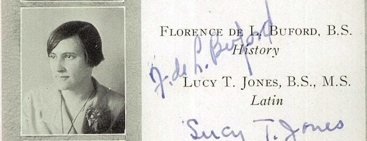
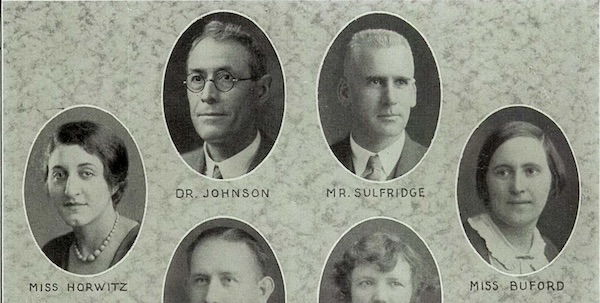
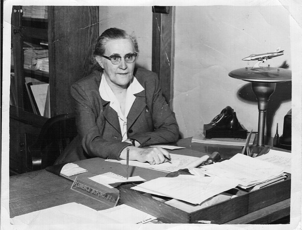

Buford Middle School is named for ​**Florence De Launey Buford (1893-1974)​**.  Charlottesville opened both Buford Junior High and Walker Junior High (named for [H. H. Walker](../haswell-hunter-walker)) in 1966 as part of a complete reorganization to racially integrate city schools.

*Buford in the 1928 "The Chain" Lane High yearbook*

Buford taught history at Charlottesville's white high school, Lane High, starting in the 1927-28 school year. In 1931, she became the first principal at the new white primary school, [George Rogers Clark](../george-rogers-clark) School, and was principal there until her retirement in 1964.

*Buford in the 1931 "The Chain" Lane High yearbook*

Buford was born in 1893, in Lawrenceville, Brunswick County, Virginia. Her grandfather, Francis Emmet Buford, served as a captain of a Brunswick company in the Confederate States Army during the Civil War. 

Buford graduated from Farmville College (now Longwood University) in 1913, then attended Columbia University and received a  Master's degree from UVa in Political Science.

*Buford at Clark, undated* 

Through UVa, Buford was a member of the Delta Kappa Gamma educators society and the Lychnos Society honor society, both of which were then all-female and all-white. She participated in numerous community service organizations, including president of the State Department of Elementary Principals, vice chair of the Charlottesville-Albemarle Library Board (which would later merge with the Jefferson-Madison Regional Library), a member of the city welfare department advisory board, vice president of the Community Chest, president of the Mental Hygiene Society of Charlottesville, a member of the Salvation Army advisory board, and on the board of the Civic League of Charlottesville and Albemarle.  Her obituary states that she "was influential
in the General Assembly's establishment of a school for the mentally retarded
in Charlottesville" and her family requested contributions be made to the Charlottesville-Albemarle Association for Retarded Children, now known as [The Arc of the Piedmont](https://arcpva.org/).

## References

* The Daily Progress, *Former City Principal Dies*, April 8, 1974