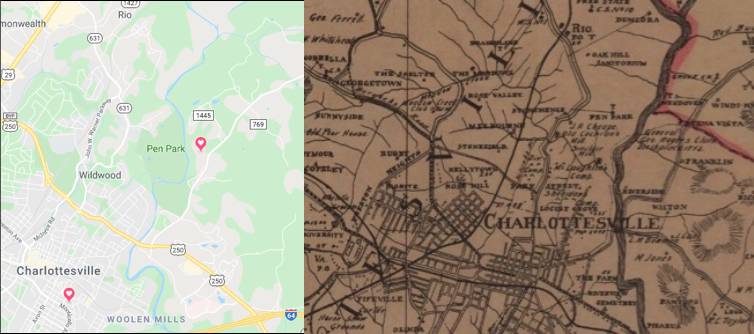

George Rogers Clark Elementary School opened in 1931 in the Belmont neighborhood of Charlottesville, Virginia, as the primary school for white students living on the east side of the city.

(taken Nov 13 1936 by James G. Johnson)

(taken 2019)

Ten years prior, [Paul G. McIntire](https://www.cvillepedia.org/Paul_Goodloe_McIntire) had funded what is likely the most visually racist statue in the United States, *George Rogers Clark* by Robert Ingersoll Aitken, on the Grounds of the University of Virginia.  

The inscription for this statue heroically proclaims Clark "Conqueror of the Northwest".  

So, who was Clark, and why does Charlottesville have a school named after him?

On the Charlottesville City Schools website, the [About Clark Elementary School](charlottesvilleschools.org/clark/us) page states:

>"The school is named for George Rogers Clark, the American frontiersman and Revolutionary War general. (Clark’s younger brother William was half of ‘Lewis & Clark.’)"

This is an intentionally simplified and sanitized summary of Clark.  A more accurate summary is:

> George Rogers Clark was an American miliary officer who executed US government policy to eradicate Native Americans from what is now the Midwest of the United States before, during, and after the Revolutionary War.  His family grew wealthy through enslaving Black people on their several plantations.  

Let's dig a little deeper. 

Clark was born in 1752 on his family's plantation in Albemarle County, Virginia, on the Rivanna River, only a few miles north of Clark Elementary.  The image above is a modern map (left), marking the location of Clark Elementary and Clark's birthplace, beside the 1909 Massie map, labeling "General Geo. Rogers Clark Birthplace 1752" near what is now Route 20. 

The location is marked with a plaque set on a large natural stone. 

> Near this spot was born, in 1752,  
> George Rogers Clark  
> Hero of Vincennes  
> Who, a colonel in the Virginia Militia, in 1777-1779, conceived, planned and accomplished the conquest of "The Illinois Country."  
> Erected by Albemarle Chapter  
> Daughters of the American Revolution  
> 1925  
> In recognition of the initiative, courage and brilliant achievement of this great soldier-son of Albemarle  

When Clark was four years old, in 1756, his family moved to Caroline County, Virginia, southeast of Fredricksburg, after his father inherited a better property from Clark's uncle, John Clark II.  At 19, Clark left to be a surveyor in what is now Kentucky, and then still part of Virginia.  

He began his military career during Lord Dunmore's War in the Virginia militia against the Shawnee and Mingo American Indian nations.  When the Revolutionary War begin, he was commissioned as a lieutenant colonel and led a militia during the Illinois campaign.  The majority of the engagements during this, including Kaskaskia (1778) and Vincennes (1779), were against British-led units consisting primarily of allied Native American fighters.  He was later promoted to brigadier general, and was the highest ranking officer in the western theatre of the war. Several years later, he led units during the start of the Northwest Indian War (Little Turtle's War) against a confederation of British-supported Native American nations, but was pushed out after a failed mission and competing officers used his alcoholism to discredit him.  

This highway marker, replaced with revised text in 2016, stands about a mile from his birthplace:

Though the original 1928 marker was quite different:

The missing part here is that "defender of Kentucky" really means "defender of white settlers in Kentucky against Native Americans, who sought to reclaim land that was taken from them".  And note that "Conqueror of the Northwest" is removed, since the "conquering" was ostensibly against the colonial power of Britain, but practically against the Native Americans who had already settled on or claimed rights over the land.  

However, Clark's victories were largely symbolic rather than militarily important -- symbolic of the nascent United States' ability to perpetuate a settler-colonialist agenda on the "frontier" against Native Americans. Even Clark's most significant victory, the capture of Fort Sackville at Vincennes, was done with only 160 men, compared with the Continental Army's numerous eastern engagements with thousands of troops.  

This settler-colonist agenda of what we now call genocide is made explicit in the 
[correspondence between Clark and then Governor of Virginia Thomas Jefferson](https://founders.archives.gov/search/Correspondent%3A%22Clark%2C%20George%20Rogers%22%20Correspondent%3A%22Jefferson%2C%20Thomas%22).

In an unsent draft of one letter to Clark, Jefferson makes this policy clear:

>From Thomas Jefferson to George Rogers Clark
>1 January 1780
>
>"I think the most important object which can be proposed with such a force is the extermination of those hostile tribes... The Shawanese, Mingos, Munsies and Wiandots can never be relied on as friends, and therefore the object of the war should be their total extinction, or their removal beyond the [Great] lakes or the Illinois river and peace."

However, [Jefferson actually decided](https://founders.archives.gov/documents/Jefferson/01-03-02-0289) to give Clark the choice between the impossible task of taking Detroit, or simply waging total war against the Native Americans:

>From Thomas Jefferson to George Rogers Clark
>1 January 1780
>
>I know therefore of but two objects between which you can balance for your next summer’s operations. These are 1. an expedition against Detroit. or 2. against those tribes of Indians between the Ohio and Illinois rivers who have harrassed us with eternal hostilities, and whom experience has shewn to be incapable of reconciliation. ...the Shawanese, Mingoes, Munsies, and the nearer Wiandots are troublesome thorns in our sides. However we must leave it to yourself to decide on the object of the campaign. If against these Indians, the end proposed should be their extermination, or their removal beyond the lakes or Illinois river. The same world will scarcely do for them and us.

Another [letter from Clark](https://founders.archives.gov/documents/Jefferson/01-03-02-0654) describes the genocidal actions he took:

>From George Rogers Clark to Thomas Jefferson
>22 August 1780
>
>After destroying the crops and buildings of Chelecauthy, we began our march for the Picawey settlements on the waters of the big Miame…
>
>…having done the Shawanese all the mischief in our power; after destroying Picawey settlements, I returned to this post, having marched in the whole, 480 miles in 31 days.
>
>We destroyed upwards of 800 acres of corn, besides great quantities of vegetables…
>
>I could wish to have had a small store of provisions to have enabled us to have laid waist part of the Delaware settlements, and falling in at Pittsburg…

Clark makes his views brutally clear in his memoir:

>I wanted an excuse to put [the Indian partizans] to Death or other ways treat them as I thought proper that the Cries of the Widows and Fatherless on the Frontiers that they had occationed now Required their Blood from my Hands...
>
>*George Rogers Clark’s Memoir: The Conquest of the Illinois*

As was typical for wealthy families in Virginia at that time, the Clark family enslaved numerous people on their plantations.  The will of Clark's father contains the following:

> "I give and bequeath to my son George Rogers and to his heirs and assigns forever, one negro man named Lue, also one negro woman named Venice, with live, present, and future increase, except Peter."  
>
> Will of John Clark III

George's brother William, of Lewis & Clark, received Venice's son Peter. 

Clark spent a significant amount of his personal wealth funding his military units, most of which wasn't repaid by the state of Virginia until after his death.  This is the primary reason why his will consists primarily of various undeveloped land grants.  In the will of his younger brother William, of Lewis & Clark, that Clark had to "borrow" a body servant from his brother, as he likely had already sold all of his slaves to pay debts. 

>"Be it known that Kitt, having served faithfully, and as the body servant of Genl. George R. Clark deceased, conducted himself for many years with entire approbation, is hearby liberated from any involuntary servitude…"  
>
>Signed by William Clark, 31 March, 1818

But **why** would it be so important to put up a statue to Clark in 1921, and name a school after him ten years later?

**Paul G. McIntire**.  [McIntire](https://www.cvillepedia.org/Paul_Goodloe_McIntire) was born in Charlottesville just prior to the secession of Virginia that precipitated the Civil War. After making his fortune in Chicago, retired back to the City.  He donated a significant amount of money to both UVA and the city and country, as evidenced by the numerous places named for him.  These donations include both the *Robert Edward Lee* and *Thomas Jonathan Jackson* statues in downtown Charlottesville.

Both McIntire's mother, Catherine (Ann) Clarke McIntire, and his first wife, Edith Clark, were members of the Clark/Clarke family of Virginia, though not through George Rogers or his immediate family. McIntire held significant sway in Charlottesville due to his financial patronage, so after having supported naming Venable Primary for Col. Charles S. Venable, aide-de-camp to Gen. Robert E. Lee, in 1924, he supported naming the new white school for George Rogers Clark in 1930.

>At a regular meeting of the School Board held March 20, 1930, Mr. Paul G. McIntire appeared before the School Board and set forth in a very clear and concise manner his reasons for thinking the name, George Rogers Clark, especially appropriate for the new school plant. At this meeting the name George Rogers Clark School was given to the new building to be constructed.  It is not necessary to discuss the felicity of this name. Clark was born almost in sight of the location of this school building, and his services to Virginia and the nation are well known.
>
> Dr. James G. Johnson in *History of George Rogers Clark School, 1928-1936*

1929 had been the 150th anniversary of the capture of Fort Sackville by Clark, which brought renewed attention to him, including the George Rogers Clark Memorial erected in Fredericksburg that year by the Paul Revere Chapter of the Daughters of the American Revolution of Muncie, Indiana.

McIntire had already funded as the statue *George Rogers Clark* ten years prior. The statue was unveiled on Nov. 3, 1921, a mere two weeks after the Oct. 19th unveiling of the infamous *Thomas Jonathan Jackson* ("Stonewall" Jackson) statue in Charlottesville.

The September 1921 issue of *The University of Virginia Alumni News* describes the new statue thusly:

> In his work Mr. Aitken depicts an incident in the adventurous achievements of George Rogers Clark who has been called "The Hannibal of the West". He is shown parleying with two apparently hostile chiefs with his group of Indian hunters prepared to aid him.  One of his men is seen crouching over a barrel of powder and The Conqueror of the Northwest is evidently explaining the futility of a resistance. The Indian squaw with the chiefs is inviting the mercy of the invaders and begging for the protection of her young baby.

Refreshingly, this article does nothing to hide the blatant racism this statue intentionally represents.

The Daily Progress describes the dedication ceremony, mentioning the role of Carrie Burnley, for whom Burnley-Moran Elementary was named: 

> Miss Carrie Burnley sat on the platform next to Dr. Petrie, with but not of the veterans, while all her pupils swelled the crowd around the stand. 
>
>All of the speeches were of a very high order, Dr. Thornton, Dr. Lefevre, Dr. Alderman and Dr. Henderson spoke as finished scholars only can speak and it was a great privilege to hear them.
>
>One notable group of octogenarians on the platform held the brothers Duke and Dr. Petrie, of the old veterans, while Dr. F. H. Smith flanked them on the opposite side.

Burnley was then the principal of McGuffey Primary, first cousin of Paul McIntire though their mothers, and a "true daughter" of the Albemarle Chapter of the United Daughters of the Confederacy, as her father, Drury Wood Burnley, had fought in the Confederate States Army during the Civil War.  Also mentioned are Dr. Petrie, likely [George Petrie](http://encyclopediaofalabama.org/article/h-2578), UVA alum and coach of Auburn's first football team, Prof. Francis H. Smith, Commissioner of Weights and Measures for the Confederacy and Professor of Natural Philosophy at UVA for 53 years, and the Duke brothers, William Richard Duke and R. T. W. Duke, Jr., a [major proponent of the Lost Cause](https://news.virginia.edu/content/uva-and-history-race-lost-cause-through-judge-dukes-eyes).  

In the memorialization of Clark, we have different but related manifestations of white supremacy -- in the late 1700s we have the push to exterminate Native Americans so their land could be given to white settlers and the enslavement of Africans for the enrichment of plantation owners, and in the 1920s we have public veneration of Clark and others, such as Robert E. Lee and Stonewall Jackson, to support segregation and Jim Crow. As a community, we now have greater respect for one another in a multicultural society, and must re-evaluate the existence of these artifacts of explicit racism and white supremacy.

## Resources

* [A Report by the Genocide Ain’t Glorious Movement of Charlottesville, Virginia](http://davidswanson.org/grc/) by David Swanson
* [George Rogers Clark: Patriotism and the War Memorial](http://www2.vcdh.virginia.edu/lewisandclark/students/projects/commemoration/aitken.html)
* English, W. H. ​Conquest of the country northwest of the river Ohio, 1778-1783; and life of Gen. George Rogers Clark, [Volume I](https://archive.org/details/conquestofcountr1engl/page/n8) [Volume II](https://archive.org/details/cu31924092886104/page/n22)
* Cvillepedia [Clark Elementary School](https://cvillepedia.org/Clark_Elementary_School)
* Cvillepedia [​George Rogers Clark](https://cvillepedia.org/George_Rogers_Clark)
* ​Wikipedia​ [​George Rogers Clark](https://en.wikipedia.org/wiki/George_Rogers_Clark)
* Wilkerson, William R., and William G. Shenkir, *Paul G. Mclntire, Businessman and Philanthropist*, 1988, Charlottesville, University of Virginia, p. 1.
