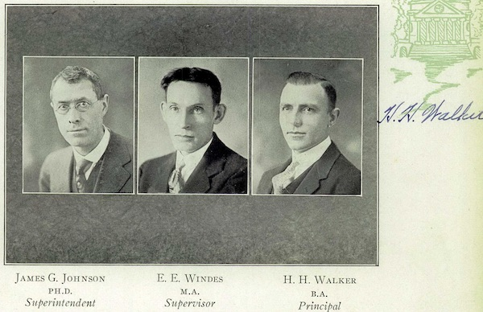
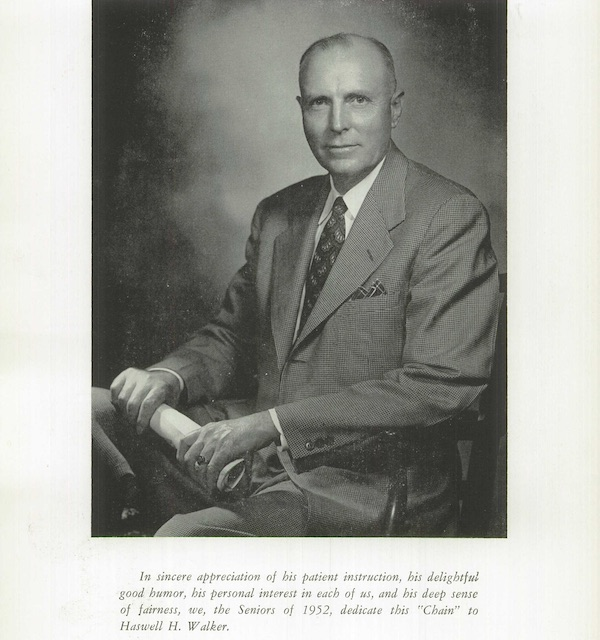

Walker Upper Elementary is named for ​**Haswell Hunter Walker (1896-1992)​**. Charlottesville opened both Buford Junior High (named for [Florence Buford](../florence-buford)) and Walker Junior High in 1966 as part of a complete reorganization to racially integrate city schools. Walker was an educator in City schools for 42 years, primarily teaching high school math.  Walker Junior High was named for Walker the same year he retired, 1966, then later renamed Walker Upper Elementary.

*Walker in the 1928 Lane High yearbook "The Chain"*

Walker was born in Saluda, Virginia. Walker received a B.A. from Lynchburg College (now University of Lynchburg) and an M.A. from UVa. He served for several years as principal of Unionville High School in Deltaville, Virginia, where he may also have attended high school.  Unionville High was consolidated with Syringa High after the 1924 school year. He became head of the mathematics department at Charlottesville's white public high school, Midway High, for the 1924-25 school year, was principal for three years from 1925-1928, then taught mathematics there until 1966 (Midway High was renamed to Lane High in 1925).

*The 1952 Lane High yearbook "The Chain" was dedicated to Walker*

During Walker’s first year teaching at Midway High, The Daily Progress of Oct. 2, 1924 published this about him:

>Mr. Walker is using unusually good methods in his Geometry classes. He has pupils construct every figure about which they are studying before the proof is taken up. Getting pupils to do things and see things ensures clear understanding. Teachers sometimes forget that pupils have eyes and muscles as well as ears. Knowledge comes through the use of more than one sense.

In 1958, Virginia Governor J. Lindsay Almond ordered the closure of Lane and Venable under his policy of "Massive Resistance" to prevent enforcement of a Federal court order to desegregate the two schools. During this time, Walker was an informal advisor to the Parents’ Committee for Emergency Schooling (PCES), a white group that argued for the temporary continuation of private segregation academies as a way to transition into a desegregated public school and thereby counter the staunchly segregationist group Charlottesville Education Foundation (CEF), which wanted either permanent public school segregation or permanent, state-funded segregation academies. In ​*The Moderate's Dilemma*, Andrew B. Lewis writes that Walker "tipped off the mothers [of the PCES] to a secret meeting the CEF was holding with the Lane teachers in hopes of securing their participation in the segregationist initiative before the PCES had a chance to speak with them," and thereby allowed the PCES to prevail against the CEF, preventing a more prolonged segregation of public schools.

## References

* [Cvillepedia Haswell Hunter Walker](https://www.cvillepedia.org/Haswell_Hunter_Walker)
* *​The Moderates' Dilemma: Massive Resistance to School Desegregation in Virginia*,​ Matthew D. Lassiter and Andrew B. Lewis, eds.
* *Deltaville* by Larry S. Chowning