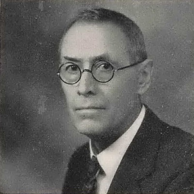
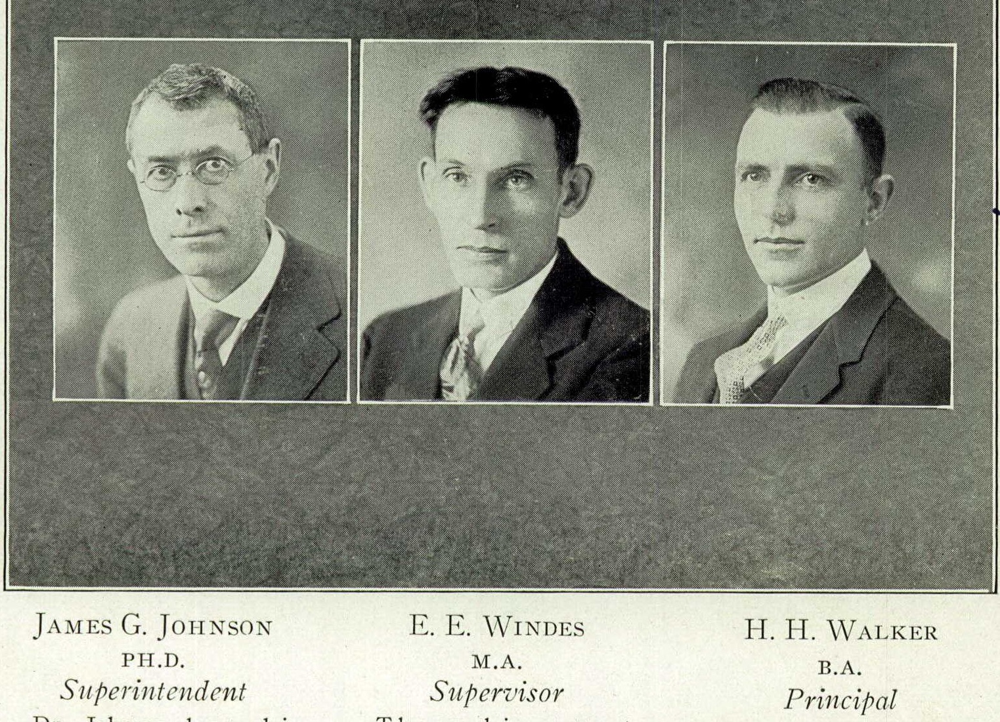
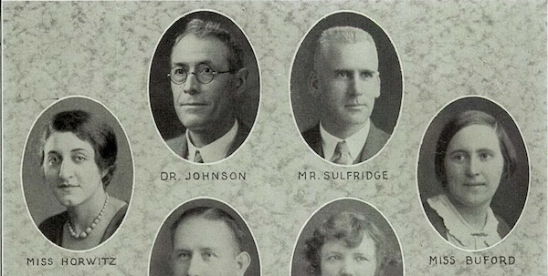
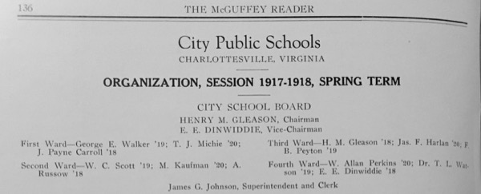

*Photo of James G. Johnson from 1943 Lane High Yearbook*

Johnson Elementary was opened in 1954 as a primary school for white students living on the west side of the city.  The school is named for **Dr. James Gibson Johnson (1871-1957)​**, who served was Superintendent of Schools for the city from 1909 to 1946. Betty Davis Via, for whom Jackson-Via Elementary is partially named, was the school's first principal. 

In 1955, African American parents and students began formal challenges to the policy of racial segregation in Charlottesville city schools, leading to Federal court rulings ordering desegregation of Venable Primary and Lane High in 1959.  Johnson Elementary was desegregated by court order in 1962, and all schools were integrated in the 1965-66 school year.   

*Johnson from 1928 Lane High Yearbook*

Johnson was born in Elk Garden, Russell County, Virginia, and later moved to Tennessee before returning to attend UVA. His father, Charles. W. Johnson, served in the Confederate States Army during the Civil War, then spent a single session at the UVA School of Medicine before becoming a physician.

Johnson received his Bachelor’s degree from [Milligan College](https://en.wikipedia.org/wiki/Milligan_College) in Tennessee, taught for seven years in Tennessee, then received his Master's (1906) and Doctorate in English (1909) from UVA. That same year, he became Superintendent of Schools for the racially-segregated Charlottesville public school system, holding that position until his retirement in 1946.

*Johnson from 1931 Lane High Yearbook, Florence Buford at right*

During his time as Superintendent, Johnson oversaw the construction of several school buildings, two of which are still in use as public schools and the others as cultural or local government facilities. When he started, Midway housed both the white primary and high schools (grades 1-11), and the "old" Jefferson School building (now-demolished) housed the Black primary school (grades 1-7), as there was no Black high school in the city or county. Johnson's building program included McGuffey Primary (white, now McGuffey Arts Center), Venable Primary (white, now Elementary), George Rogers Clark School (white, now Elementary), Lane High (white, now the Albemarle County Office Building), improvements to the original Jefferson Elementary, and the first building for the new Jefferson High (Black, first section of what is now the Jefferson School City Center and location of the Jefferson School African American Heritage Center).  

*The McGuffey Reader supplement, City Public School Organization 1917-18*

It is difficult to precisely evaluate Johnson's actions in the context of a system what was ostensibly "separate but equal", but was inherently "separate but unequal".  Yearly per-pupil expenditure for white students was typically double that of Black students, and even greater in aggregate when considering the lack of an accredited four-year high school program for Black students until 1929-1930. The same documentation from Johnson's correspondence can be used to argue either his disinterest in equality of educational opportunities for Black students, or that he significantly improved them through "subversive" action couched in the language of white paternalism.  This is beyond the scope of this article, as it merits significant further investigation.

One aspect of the segregated system in which he worked is the contrast between the grand, neoclassical Venable School building, and industrial, utilitarian "new" Jefferson School building, which were constructed within a few years of one another. The architectural and historical comparisons between these buildings are documented extensively in *Venable and Jefferson: Cultural Monuments of Two Communities* by Elizabeth Moore ([reprinted here](https://www.jmrl.org/ebooks/Jefferson%20School%20Oral%20History%20Pr.PDF)) and *Pride Overcomes Prejudice: A History of Charlottesville's African American School* edited by Andrea Douglas.

In 1936, he edited and contributed to a [detailed history](../johnson-history) of the Charlottesville schools and significant detail on the history of public schools in Virginia that was published as a supplement to the The McGuffey Reader, a magazine published by McGuffey School.  He also published volumes of student material from Venable (The Sentinel) and Clark (The Frontiersman) as supplements to The McGuffey Reader, and an autobiography 1947. His voluminous school-related papers are in the UVA Library Special Collections.

## Resources and References

* Johnson, J. G., *Autobiography*
* Johnson, J. G., *​Education Pamphlets: Vol. 3.​ 1936. History of McGuffey school, 1915-1936. History of Venable school, 1922-1936. History of George Rogers Clark school, 1928-1936.*
* James, Michael E. *The Conspiracy of the Good: Civil Rights and the Struggle for Community in Two American Cities, 1875-2000* Peter Lang Inc., International Academic Publishers, 2004.
* *The Daily Progress*, Dr. Johnson, School Head 36 Years, Dies. June 21, 1957
* Douglas, Andrea (ed.), *Pride Overcomes Prejudice: A History of Charlottesville's African American School*
* Moore, Elizabeth, *Venable and Jefferson: Cultural Monuments of Two Communities*, reprinted in Jefferson School Oral History Project. 