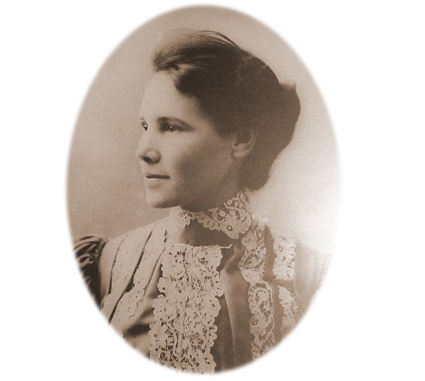

**Author's Note:** *This article is intentionally shorter than the others in this series.  Nannie Cox Jackson was an extraordinary person, especially during a time when being Black or female limited one's possibilities even more than today. Her story needs to be told in full, but this author is not the right person for that important job.*

Jackson-Via Elementary is named for ​Nannie Cox Jackson​ and ​[Betty Davis Via​](../betty-davis-via). The school was formed in 1969 and moved to the current building in 1970. Jackson-Via was the city’s first school planned and built as an integrated school, thus being dually-named for both a Black educator, Jackson, and a white educator, Via.

**Nannie Cox Jackson (1865-1953)** ​was a teacher for 46 years, of which 25 years were at the all-Black Jefferson School. Jackson's contributions to the schools and community are documented in *​Pride Overcomes Prejudice: A History of Charlottesville's African American School* edited by Dr. Andrea N. Douglas and *Urban Renewal and the End of Black Culture in Charlottesville, Virginia: An Oral History of Vinegar Hill* by James Robert Saunders and Renae Nadine Shackelford. At the Jefferson School, she taught Domestic Science to both boys and girls. She started a school lunch program that she subsidized herself and organized the school's first football team. She retired in 1939. 

*Jefferson School staff, 1915-16, from Johnson.  Also listed are Benjamin Tonsler and Rebecca Fuller (McGinness)*

She co-owned the first Black-run billboard company, and was one of the largest property holders in the area, renting at affordable rates to Black families across the city.

>Mr. Jackson was a black man, and his grandmother, a woman named Nannie Cox Jackson, owned approximately 40 percent of all the land in the Vinegar Hill section. She was a very enterprising black woman who was a home economics teacher in the high school.  And she went around buying up real estate. So, a lot of the young teachers-- young couples getting married, getting started-- could always rent a place from Mrs. Jackson or from her son. W. E. Jackson was the son of Nannie Cox Jackson. And when she died back in 1963, she had an estate of over a million dollars. That's a black woman.  
>
>--Raymond Bell, from *Urban Renewal and the End of Black Culture in Charlottesville, Virginia: An Oral History of Vinegar Hill*

## References

* [Cvillepedia - Nannie Cox Jackson](https://cvillepedia.org/Nannie_Cox_Jackson)
* [C-ville NOW herstory: Nannie Cox Jackson](https://cvillenow.avenue.org/herstory.html)
* [Find A Grave - Nannie Cox Jackson](https://www.findagrave.com/memorial/43680775/nannie-jackson)
* [Charlottesville Heritage Trails](http://community.village.virginia.edu/heritage_trail/node/56)
* [Nancy Colbert Scott](https://www.monticello.org/getting-word/people/nancy-colbert-scott)
* *Urban Renewal and the End of Black Culture in Charlottesville, Virginia: An Oral History of Vinegar Hill* by James Robert Saunders and Renae Nadine Shackelford 
* *​Pride Overcomes Prejudice: A History of Charlottesville's African American School* edited by Dr. Andrea N. Douglas