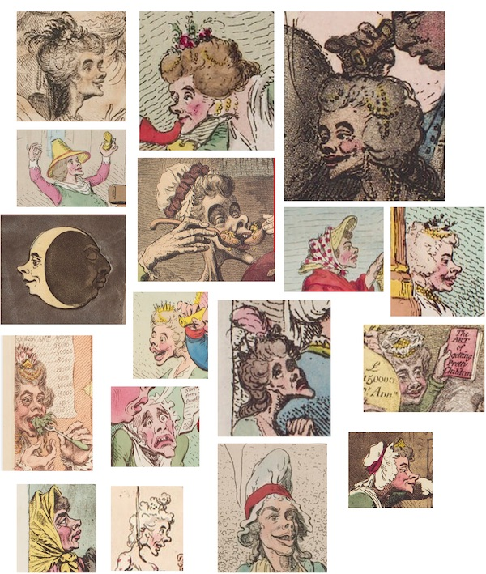

*Peoples are governed by not by realities but by myths.* 
— J. A. Rogers, 1940

*Clockwise from upper left: Thomas Frye, 1762, [RCIN 604595](https://www.rct.uk/collection/604595/her-most-excellent-majesty-charlotte-queen-of-great-britain-c); Johann George Ziesenis, 1761?, [RCIN 403562](https://www.rct.uk/collection/403562/queen-charlotte-1744-1818-when-princess-sophie-charlotte-of-mecklenburg-strelitz); Allan Ramsay, 1762, [RCIN 405308](https://www.rct.uk/collection/405308/queen-charlotte-1744-1818); Laurence Gahagan, 1818, [RCIN 913891](https://www.rct.uk/collection/913891/queen-charlotte); Thomas Lawrence, 1789, [NG4257](https://www.nationalgallery.org.uk/paintings/sir-thomas-lawrence-queen-charlotte)*

## Introduction

Since the 1940s, there has been a myth consisting of continually-evolving claims around the ancestry, ethnicity, and racial identity of Queen Charlotte. These claims began as an antiracist contention by Jamaican-American author J. A. Rogers, who intentionally used the false premises of scientific racism to refute the concept of a "pure white race" promoted by segregationists in the United States and the Nazi Party in Germany.  Over time, like the telephone game, these claims morphed as they were misunderstood, misinterpreted, and expanded upon into the varied beliefs that Charlotte was "African", "mixed-race", "biracial", or "Black." When examined in context and with factual historical information, the evidence does not support these claims.

*L-R, 'Queen Charlotte Walks in Her Garden' by B. Graham Weathers, Jr., Charlotte, NC; statue in Queen Square, London, UK; statue at Charlotte Douglas International Airport by Raymond Kaskey*

Currently, there is a wave of interest in re-evaluating who we chose to memorialize in our public landscape through monuments and statues. Queen Charlotte has long been used by White elites as matriarchal symbol to support white supremacy in her namesake city of Charlotte, North Carolina. In her other namesake city of Charlottesville, Virginia, she has been largely ignored precisely because she was the political antagonist to the City's historical patriarch, Thomas Jefferson, drafter of the Declaration of Independence, whose Monticello plantation is nearby. One motivation for suggesting the memorialization of Queen Charlotte in Charlottesville and the adoption of her as part of a "compromise narrative" by Black residents of Charlotte, NC, has been the myth that she had recent African ancestry or would today be racialized as Black based on appearance.

However, Charlotte has not been overlooked for memorialization because of either sexism or racism. At the signing of the Declaration of Independence in 1776, during her reign with husband King George III, the British Empire controlled nearly a quarter of the world's people and land, enabled the kidnapping of 3.5 million Africans to enslave (of at least 12.5 million among all colonial powers) along with Indigenous people in the Americas, and held colonial control over millions of other people. The life of Queen Charlotte is the epitome of white supremacy, no matter how keen her interest in art, botany, or Pomeranians might have been. 

## Charlotte Sophia of Mecklenburg-Strelitz

While most of this work focuses on the evolution and variations of the myth, we will start with a brief overview of her.

There is overwhelming evidence that Queen Charlotte, born Charlotte Sophia of Mecklenburg-Strelitz in present-day Germany, was a white woman according to contemporary racialization. Her [ancestry is well-documented](charlotte_ancestry_table.pdf), consisting primarily of aristocratic ethnic German ancestors. Dozens of portraits of her, painted from life, depict her with pale skin and facial features typical of Northern Europe. Numerous contemporaneous descriptions of her describe the same, and there are not more simply because few observers thought to make obvious statements about her appearance. Even the numerous, often vicious, caricatures of her depict her with pale skin and large, pointed, upturned nose and chin. 

Michael Levey includes this a composite description of her appearance in his book *A Royal Subject: Portraits of Queen Charlotte*:

> Plain in youth, she grew almost grotesquely ugly in late old age. George III had chosen her as his wife without seeing her and is said to have been rather disconcerted by her appearance when he met her first, at her arrival from Germany on the eve of their wedding. Still, as she became older, her plainness became less noticeable to some of those around her. 'The bloom of her ugliness is going off,' her Chamberlain amusingly remarked to the diarist Croker. Fanny Burney too, who met her at Bath in the penultimate year of her life, found the Queen somehow triumphing over the disadvantages of age, infirmity, sickness, diminutive stature '& Ugliness!' The variety of expression in her face, Fanny Burney recorded, made even her features seem agreeable.

> Of the Lawrence (1789) portrait, Mrs. Papendick thought the depiction of her "stronger than any I recollect," and one reviewer at the 1790 Academy Exhibition stated it was a 'the strong likeness.'

 Her appearance was regularly and brutally caricatured in the press, these being some examples:

[*'Anti-saccharrites, - or - John Bull and his family leaving off the use of sugar'* by James Gillray (1792)](https://www.npg.org.uk/collections/search/portrait/mw61555/Anti-saccharrites---or---John-Bull-and-his-family-leaving-off-the-use-of-sugar)

[*'Sin, Death, and the Devil' by James Gillray (1792)*](https://www.npg.org.uk/collections/search/portrait/mw61576/Sin-Death-and-the-Devil)

## A Summary of the Evolution of Claims

In 1940, author J. A. Rogers published the first volume of his *Sex and Race* trilogy, which used the false premises of scientific racism, specifically that a wide nose and mouth was a "Negroid" rather than "Caucasoid" characteristic, in order to refute the concept of a "pure white race". Rogers mentions Charlotte only briefly in the book, but includes a plate of a painting of her by Allan Ramsey c. 1762, and in a later book he includes a work derived from a [mezzotint](https://en.wikipedia.org/wiki/Mezzotint) by Thomas Frye in 1762. Both  artworks were made immediately after her marriage and coronation in 1761, when she was around age 17. 

In 1989, after the unveiling of a statue to Charlotte in one of her namesake cities, Charlotte, North Carolina, South African civil rights activist and Methodist minister Motlalepula Chabaku charged in a letter to the editor of the *The Charlotte Observer* that the sculptor had replaced Charlotte's "African features" with a "European or Caucasian appearance" and that "she was a black woman even though she was the consort of King George III." This is the first printed assertion that she was "black" and likely the first time Rogers' work or these claims about her had been publicized outside of the African American press in the 1950s. 

In 1999, Mario de Valdes y Cocom (Mario Valdes) claimed in an [article](https://www.pbs.org/wgbh/pages/frontline/shows/secret/famous/royalfamily.html) he wrote for a PBS Frontline website called "The Blurred Racial Lines of Famous Families" that she had an "unmistakable African appearance" and "negroid physiogomy[sic]". Valdes does not cite J. A. Rogers as a source, but uses some of the same evidence and language. Valdes makes the unsubstantiated assertion that one of Charlotte's distant ancestors, Margarita de Castro e Souza, who appears once in her 9th generation and twice in her 10th generation, was from a "black branch" of Portuguese nobility. The article on Charlotte in Wikipedia tied Margarita to Madragana, who was likely Mozarab (an Iberian Christian living in Muslim Iberia). The Valdes article and Wikipedia entry on Charlotte were then used by numerous journalists to write articles mentioning this "controversy" about Charlotte when Meghan Markle became the Duchess of Sussex upon her marriage to Prince Harry. 

## Introduction of Claims by J. A. Rogers

The first documented source of the first two of these arguments comes from J. A. Rogers's *Sex and Race: Negro-Caucasian Mixing in All Ages and All Lands, Volume I: The Old World*, published in 1940, in which Rogers presents antiracist ideas to counter the pseudoscientific belief in distinct "pure" races. Rogers was a prolific author, regularly publishing news and history articles in prominent Black newspapers and self-publishing several books. His trilogy *Sex and Race* is a combination of forceful and eloquent antiracist arguments against the myth of white supremacy and of both accurate "Black history" and (unfortunately) a grab bag  of Afrocentric pseudohistory. The renowned public historian Dr. Henry Louis Gates Jr. summarizes Roger's work with ["sometimes, he was astonishingly accurate; at other times, he seems to have been tripping a bit, shall we say."](https://www.pbs.org/wnet/african-americans-many-rivers-to-cross/history/j-a-rogers100-amazing-facts-about-the-negro/)

Rogers makes a claim that is very specific and barely a claim at all-- that according to the anthropometric factors used in "scientific" racism that a narrow nose and mouth indicate that a person is "Aryan", "Nordic", or "German", Charlotte does not conform to this look -- at least according to one portrait and an out-of-context quote. He then makes the leap that this this must indicate a "Negro strain" in her, not simply that race doesn't exist as a biological concept to begin with.

Rogers states:

>The portrait of Queen Charlotte Sophia, consort of George III, by Ramsay clearly shows a Negro strain. Horace Walpole, who saw her, wrote of her, "nostrils spreading too wide; mouth has the same fault."

For visual evidence, Rogers includes a low-quality monochromatic reproduction of the 1762 Allan Ramsay portrait. Below, the image from *Sex and Race* on the left, compared with the original painting on the right.

Rogers describes this image with:

> Charlotte Sophia, German-born consort of George III, had the broad nostrils and heavy lips "of the blond Negroid type" mentioned in Brunold Springer on page 11 of this book. Horace Walpole, who saw her wrote: "Nostrils spreading too wide. Mouth has the same fault." (National Biog. Vol. IV, p. 123).  It would have been possible to reproduce several pictures of Negroes who resemble this English queen. I have one of a little Negro musician, whose features, especially in the mouth, is strikingly like hers.
>
> This blond Negroid type is not uncommon even in Nordic Europe. As we have seen, whites and blacks have been mixing all over Europe from the dimmest antiquity. 

At least one description (Gregory 2016) has been mis-interpreted this to mean that Brunold Springer, a German-Jewish lawyer and amateur racial pseudoscientist, made claims about Charlotte, which he did not. Springer's work is focused solely on a presenting a theory of scientific racism to counter the extant white supremacist ones promoted by Nazi scientists. (His theories are still wrong, since race doesn't exist as a biological concept, but at least he wasn't a Nazi.)

As for Rogers' quote from Horace Walpole, a contemporary of Charlotte, we see a description of the new Queen with a hypercritical focus on how well conforms to the English beauty standards of the day. The complete quote is: 

> She is not tall nor a beauty; pale, and very thin; but looks sensible, and is genteel. Her hair is darkish and fine; her forehead low, her nose very well, except the nostrils spreading too wide; her mouth has the same fault, but her teeth are good. She talks a great deal, and French tolerably;... 
>
> from *The Letters of Horace Walpole, Earl of Orford, Volume 3*, p.434; appearing in *Dictionary of National Biography. Vol. X (Chamber to Clarkson)*). 

In 1952, Rogers included a low-quality reproduction of an engraving derived from Frye's mezzotint in his book *Nature Knows No Color-Line: Research into the Negro Ancestry in the White Race*.

*L-R: original mezzotint "HER Most Excellent Majesty Charlotte Queen of GREAT BRITAIN &c." by Thomas Frye (1762) ([RCIN 604595](https://www.rct.uk/collection/604595/her-most-excellent-majesty-charlotte-queen-of-great-britain-c
)), claimed to have been done from life while Charlotte was at the theatre; a lower-quality line engraving derived
from Frye's mezzotint (1762) ([NPG D10817](https://www.npg.org.uk/collections/search/portrait/mw17686/Charlotte-of-Mecklenburg-Strelitz); reproduction in 'Nature Knows No Color-Line'*

In later editions of his 1934 book [*100 Amazing Facts About the Negro with Complete Proof: A Short Cut to The World History of The Negro*](https://books.google.com/books?id=JusKBgAAQBAJ), at least after 1940, Rogers included a reference to Charlotte from *Sex and Race*, with an article "Negroid Blood in Hitler's 'Aryans'" from *The New York Times*, July 1, 1940:

## Modern Claims by Motlalepula Chabaku (1989)

It is not well-documented how widespread the belief in or attention to Roger's claims were, as Queen Charlotte had little relevance to 20th century Americans and his work had little exposure among white audiences. However, the interest was likely higher in the city of Charlotte, North Carolina, as white elites had been using her as a symbolic matriarch of the city, and had consistently used her as such as part of an agenda of white supremacy throughout the 19th and 20th centuries. Gregory states that whites had been countering the claims about Charlotte since at least 1934, but offers evidence that does not support this assertion.  

All for the newspaper articles referenced below can be found in a PDF [here](charlotte_newspaper.pdf).

The Jan. 27, 1989 *The Charlotte Observer* has a front page photo of a sculpture of Queen Charlotte by B. Graham Weathers under the title "The Queen, In Bronze," and an article by John Wildman entitled "Statue of Queen Takes Its Bows."  The article includes a fairly standard biography of her. There is no mention of ancestry claims, as the claims were likely not well known to whites in Charlotte, and the author and Weathers were not aware of them.

Several days later, on Feb. 3, 1989, Motlalepula Chabaku, a South African civil rights activist and Methodist minister in Charlotte, charged in a letter to the editor of the The Charlotte Observer that the statue changed Charlotte's "African features" to a "European or Caucasian appearance" and that "she was a black woman even though she was the consort of King George III." This letter is likely the first time this claim was published outside of the self-published and African-American press work of J. A. Rogers.

A feature article a few days later uncritically presents several perspectives, including misattributing an assertion by J. A. Rogers to one of Charlotte's contemporaries, Horace Walpole. 

On Feb. 16, 1989, Weathers responds to Chabaku's claims in another letter to the editor, defending himself against the accusations that he deliberately changed her appearance and recounting the steps he took in creating her likeness. The tone of Weathers's response indicates that he was unaware of any claims that she was "black," which is likely true given that Rogers's work had not achieved widespread awareness among Whites even while he was alive.

Several days later, on Feb. 22, 1989, *The Charlotte Observer* published a feature article "Some Say Queen Charlotte Can Claim African Ancestry" by Ed Martin. This article uncritically presents several perspectives, and misattributes the modern assertion by J. A. Rogers (the "pictures of Negroes" quote) to Horace Walpole.

In the article, Weathers is quoted as saying that there was "no suggestion in skin color, width of nose, thickness of lips, that might suggest Negroid descent." He did not use the term "Negroid" in his initial response letter to Chabaku's claim and it is quite an arcane term bordering on racist, something Weathers would have been cautious about in this context in 1989, so it seems likely that Weathers was told about Rogers' work between the letter and the interview. With all of the research into Charlotte that Weathers describes in preparation for the sculpture, if he didn't know about these claims prior to Chabaku mentioning them, then it's unlikely many other whites did either.

## Popularization of Claims by Mario de Valdes y Cocom

In 1999, [PBS Frontline](https://www.pbs.org/wgbh/frontline/) developed a website called ["The Blurred Racial Lines of Famous Families"](https://www.pbs.org/wgbh/pages/frontline/shows/secret/famous/), featuring "white" European and American families who either had or possibly had "non-white" ancestors, as companion material to a PBS Frontline program by producer June Cross called ["Secret Daughter"](https://www.pbs.org/wgbh/pages/frontline/shows/secret/), described as "the story of a mixed race daughter and the white mother who gave her away," about Cross's own experience of being biracial and adopted. It has been widely misrepresented that this program contained content about Charlotte, though it is only the companion website that has information about her.

The majority of this content was developed by Mario de Valdes y Cocom (also named as Mario Valdes in places), a self-described "historian of the African diaspora." In this work, Valdes makes several novel claims. None of these are sourced, so it is difficult to verify that the references, and many are so imprecise as to make it difficult to know even what the claim means. Valdes makes no reference to the work of J. A. Rogers, even though some of the claims sound similar, such using the antiquated term "negroid." 

Valdes claims that Charlotte had an "unmistakable African appearance" and "negroid physiogomy[sic]". He makes the claim that "the black community, both in the U.S. and throughout the British Commonwealth, have rallied around pictures of Queen Charlotte for generations," though provides no evidence for this bold statement. In a 2017 interview, Valdes stated that "I had heard these stories from my Jamaican nanny, Etheralda 'TeeTee' Cole." (Valdes himself is Belizean-American.)

Valdes cites the same portrait by Sir Allan Ramsay of Charlotte at age 17 as Rogers does, but misrepresents that Ramsay was responsible for "the majority of the paintings" of her. He painted only this one single portrait from life of her in 1762, but his studio made a large number of copies of it, including the one held by the Mint Museum in Charlotte, NC. Valdes also claims that "[Ramsay's] representations of her were the most decidedly African of all her portraits." This is a slippery claim to refute, as it implies that there is an "African" look one can have and that this stylized artwork is intended to be an exact representation of her. Ramsay's painting is quite different than her depiction as a relatively unattractive Northern European woman in other portraits. Valdes presents as visual evidence a small image of of one of the Ramsay variation portraits and the Frye-derived engraving that appears to be from Rogers's *Nature Knows No Color-Line*.

Valdes states "the most valuable \[quote would\] be the one published in the autobiography of the Queen's personal physician, Baron Stockmar, where he described her as having '...a true mulatto face.'" There are several things wrong with this quote as evidence.  Christian Friedrich, Baron Stockmar was not "Queen's personal physician," but rather physician-in-ordinary to Prince Leopold of Saxe-Coburg-Gotha (later Leopold I of the Belgians) and Queen Charlotte's granddaughter, Princess Charlotte of Wales (1796–1817). (These Charlottes should not be confused with Charlotte, Princess Royal (1766–1828), eldest daughter of Queen Charlotte and King George III, later Queen consort of King Frederick I of Württemberg.) Stockmar describes her in his journal as 
"Small and crooked, with a true Mulatto face." ("Klein, verwachsen, ein wahren Mulattengesicht."). The context for this description is critical— Stockmar made this observation in June 1818, when the Queen was 74 years old and suffering from severe ill health, that would result in her death only a few months later, in November 1818. He is not describing her as someone who looks "biracial", but instead using "Mulattengesicht" as a racial slur to describe a dying, possibly-jaundiced patient. In Olwen Hedley's 1975 biography of Charlotte, this is so apparent from the context that Hedley makes no note of it as even possibly being a racial description of her.

Valdes also claims "Perhaps the most literary of these allusions to her African appearance, however, can be found in the poem penned to her on the occasion of her wedding to George III and the Coronation celebration that immediately followed." The implication of the phrasing is that the poem was actually part of her wedding and coronation.  It was actually written by an obscure English physician and amateur poet Samuel Bowden, who had never even seen an image of her, and published in the magazine *The Gentleman's Magazine and Historical Chronicle* the same month as her coronation. Valdes focuses in on only a few lines from this long poem:

> Descended from the warlike Vandal race,
>
> She still preserves that title in her face.
>
> Tho' shone their triumphs o'er Numidia's plain,
>
> And Andalusian fields their name retain;

Even if Bowden was trying say Charlotte looked "African", he certainly did a good job burying what would have then been a racist slight under a mountain of otherwise-laudatory Romantic hyperbole that surrounds these lines.  

The Vandals were a Germanic people whose territory migrated through conquest from Scandinavia and northern Germany, to the Iberian peninsula, to North Africa; they then sacked Rome in 455, and then after their defeat against Rome in the Vandalic War, were dissolved as a distinct people and incorporation into numerous other kingdoms around the Mediterranean. In this context, "race" is used to signify a distinct group of people, rather than in the modern sense of racial identity, and, more practically, it rhymes with "face". Numidia was an kingdom of ethnically Berber people in North Africa whose territory covered most of the north of what is now Algeria. The "triumphs" mentioned refer to the fact that the Vandals conquered this area from its Berber inhabitants, perhaps drawing an allusion to the British Empire's numerous colonial territories. Andalusia, the area of southern Iberia, which was was then and still is widely thought to have been named for the Vandals by later Arab conquerors ("Al-Andalus"). Valdes misquotes "And Andalusian" as "And and Alusian", which is retained in nearly every other article that discusses this myth, indicating that these articles are frequently derived from Valdes.

In this work, Valdes claims Charlotte's link to Margarita de Castro y Sousa, but does not mention the further distant link to Madragana (which appears later in the GEN-MEDIEVAL mailing list thread and makes its way into Wikipedia). Valdes uses Charlotte's ancestor Margarita de Castro y Sousa as evidence, stating that there are "six different lines" of ancestry between them, even though there [only three lines of ancestry between them](charlotte_ancestry_table.pdf). Margarita appears once in Charlotte's 9th generation and twice in Charlotte's 10th generation, accounting for 1/256th of Charlotte's ancestry. 

Valdes then makes the uncited claims that the Sousas were "a black branch of the Portuguese Royal House" and were "black" because two unnamed "art historians" claimed that the "black magi" featured in 15th century Flemish paintings of the "Adoration of the Magi" were modeled after members of the Sousa family, though there is no evidence or even a source for either of these claims. It is possible that this is a misinterpreted reference that the models for the painting were sub-Saharan Africans who were enslaved by the Sousas, rather than Sousas themselves. 

## Further distortion and inflation of claims (1999-2013)

On June 6, 1999, *The Sunday Times*, a British newspaper, published a sensationalist article ["Revealed: The Queen's Black Ancestors"](revealed_sunday_times_1999.txt) by Jon Ungoed-Thomas and Eduardo Goncalves. This  contains quotes from an interview with Valdes, notes that Duarte Nuno Souso Chichorro Marcao, one of "Afonso III's Portuguese descendants... has confirmed the connection" with Madragana, misidentifies Madragana's father as "Madrem, the Moorish king of the Algarve capital" (her father was actually Aloandro Ben Bekar, and Madrem seems to be entirely made up), and quotes from several other people. A few weeks later, on June 20, 2003, an anonymous user [added](https://en.wikipedia.org/w/index.php?title=Charlotte_of_Mecklenburg-Strelitz&oldid=1410042) references to Valdes' work to the Wikipedia page [Charlotte_of_Mecklenburg-Strelitz](https://en.wikipedia.org/w/index.php?title=Charlotte_of_Mecklenburg-Strelitz).  

On March 11, 2009, *The Guardian*, a British newspaper, published an article ["Was this Britain's first black queen?"](https://www.theguardian.com/world/2009/mar/12/race-monarchy) by Stuart Jeffries. This article is framed around the city of Charlotte, North Carolina, and includes numerous quotes from historians, all of whom express skepticism over Valdes' claims. Jeffries begins the piece with the claim that Charlotte is "the woman said to be Britain's first black queen," in a way that assumes that this is either a correct or widely-accepted statement.

Jeffries includes a quote from Cheryl Palmer, director of education at the Mint Museum in Charlotte, NC, saying that she was "a person who may have had African forebears." Again, this is an expansion from "black Portuguese" or "Moorish" to "African," which has the connotation that they were sub-Saharan African, and thereby would be racially categorized as Black, instead of (possibly) of North African Berber or Arab heritage as Madragana may have been. Jeffries inflates Valdes's claims, stating "[Valdes] argues that her features, as seen in royal portraits, were conspicuously African, and contends that they were noted by numerous contemporaries," where the supposed six sources Valdes says (only two of which Valdes quoted) now becomes "numerous." 

Jeffries include a section with Valdes's claims that Madragana was "a Moor and thus a black African," though he chooses not to provide even the most basic fact check of the misconception that "Moors" were "black."  This is interesting as Valdes had never mentioned Madragana, and this was added by *The Sunday Times* article.  Jefferies also presents the racist idea that "perhaps, instead of just being a boring bunch of semi-inbred white stiffs, our royal family becomes much more interesting," as if "blackness" is so magical that even very distant African ancestry automatically makes one "interesting."

Jefferies quotes former Congressman Mel Watt, who eloquently describes the "compromise narrative" that this myth allows for, such that Charlotte can transcend her use as a symbol of white supremacy and represent the entire community:

> In private conversations, African-Americans have always acknowledged and found a sense of pride in this 'secret'.  It's great that this discussion can now come out of the closet into the public places of Charlotte, so we all can acknowledge and celebrate it... We were a lot more immigrant-friendly in those days than we were friendly to people of colour.... We all recognized that we all came from some place else. But there was always a sense of denial, even ostracism, about being black. Putting the history on top of the table should make for opportunities for provocative, healing conversations.

And also quotes Eulada Watt, Mel Watt's wife, with:

> I believe African-American Charlotteans have always been proud of Queen Charlotte's heritage and acknowledge it with a smile and a wink... Many of us are now enjoying a bit of 'I told you so', now that the story is out... Hopefully, the sketchiness will inspire others to further research and documentation of our rich history. Knowing more about an old dead queen can play a part in reconciliation.

In the 2013 book *Race, Romanticism, and the Atlantic*, Paul Youngquist writes an essay entitled "The African Queen" about the relationship between race and British Romanticism. One of the interesting parts of this essay is how the inclusion of "blackness" various works of art and literature reveals the inherent "whiteness" which was heretofore "transparent."  Youngquist intentionally avoids the question of whether than ancestry claims are true or not, and instead analyses various works from the perspective that if race is intentionally included in them, typically in the form of mildy-exoticized features (referencing the possible use of this in the Ramsey portrait) or tangential context, and how that affects the "whiteness" at the forefront of those works. Youngquist argues not that the painters were trying to "cover up" any "African" features she may have been perceived to have had as Valdes charges, but rather they were trying to retrofit them onto her to either support their own abolitionist agenda, engender support among the millions of diverse peoples that the British Crown had colonized and/or enslaved, and exoticize her precisely to reveal her whiteness in Romantic style.

## Claims brought on by the engagement of Meghan Markle

The most recent public revival of this myth surrounded the engagement and marriage of Meghan Markle to Prince Harry. Markle is American and self-identifies as biracial, as her father self-identifies as white and her mother self-identifies as Black. This is the first time that a person who was not white has married into the British royal family. 

After their engagement, numerous articles appeared that had the effect of downplaying what was a momentous first, particularly in light of the extreme criticism that Markle faced, much of it overtly racist.  Articles with titles like ["Meghan Markle Might Not Be the First Mixed-Race British Royal"](https://www.history.com/news/biracial-royalty-meghan-markle-queen-charlotte) by Erin Blakemore, ["Britain’s black queen: Will Meghan Markle really be the first mixed-race royal?"](https://www.washingtonpost.com/news/retropolis/wp/2017/11/27/britains-black-queen-will-meghan-markle-really-be-the-first-mixed-race-royal/) by DeNeen L. Brown, and
 ["Is Meghan Markle's mixed-race heritage a first for British royalty?"](https://www.inquirer.com/philly/news/meghan-markle-mixed-race-prince-harry-queen-charlotte-20171128.html) by Valerie Russ revived the Charlotte ancestry myth in service of sensational journalism, with the effect of side-lining Markle's historical moment. 

DeNeen Brown's article refers to Madragana as "Ouruana, a black Moor," even though there is no evidence she was Black and most "Moors" (or, rather, North African Berbers and Arabs) are not.  Brown includes the "mulatto-face" quote from Stockmar, and includes an out-of-context and misinterpreted quote Sir Walter Scott, saying "Scott wrote that she was 'ill-colored' and called her family 'a bunch of ill-colored orangutans.'" This quote comes from *Memoirs of the Life of Sir Walter Scott: In Three Volumes, Volume 4* by Scott:

> There are some fine paintings, and some droll ones: among the last are those of divers[sic] princes of the House of Mecklenberg-Strelitz, of which Queen Charlotte was descended. They are ill-colored, ouran-outang-looking figures, with black eyes and hook-noses, in old-fashioned uniforms.

Scott is not describing Charlotte herself, as she had been dead for eight years at time of writing, but rather oil paintings of Charlotte's ancestors. Scott is recounting walking through the "old apartments" in Windsor Castle in October 1826 (eight years after Charlotte's death), while they are being renovated. Scott is clearly commenting on the near-comical-bad paintings. 

Brown also expands earlier claims about the "wide" nose and mouth in the 1762 Ramsey portrait to make the novel claim that "her skin appears to be café-au-lait," a statement that does not match with the actual paintings. In another article in 2018, ["Meghan Markle, Queen Charlotte and the wedding of Britain’s first mixed-race royal"](https://www.washingtonpost.com/news/retropolis/wp/2018/05/15/meghan-markle-queen-charlotte-and-the-wedding-of-britains-first-mixed-race-royal/), Brown further expands this claim to one that upon Charlotte's arrival in England, "crowds of commoners stretched to see this first encounter between the king and his princess, whose brown hair was piled high in curly ringlets falling about her long neck and that appeared to be a beautiful cafe-au-lait." This transforms her already-novel (and incorrect) statement about Charlotte's skin color in the Ramsey portrait in her 2017 article into a "fact" about Charlotte when she first met George III.

In contrast to some of the sensationalist pieces during this time, Jill Sudbury wrote an article ["Royalty, Race and the Curious Case of Queen Charlotte"](http://acaciatreebooks.com/blog/royalty-race-and-the-curious-case-of-queen-charlotte/), where she provides an eloquent description of Charlotte's life, her numerous portraits, and thorough but respectful analysis of the the "African ancestry" claims. 

## Conclusion

In 2020, Lisa Hilton's article ["The 'mulatto' Queen"](https://thecritic.co.uk/issues/february-2020/the-mulatto-queen/) puts these claims in the context of historical fiction film. Most of the article is Hilton dismissing the claims, however even she mistates them, claiming a unique variant that Stockmar "described her at birth as having 'a true mulatto face'," which cannot be true as Stockmar was born after Charlotte. Hilton  presents the desires of the director to center the film around this myth with a very condescending manner, which has been a common tone for responses to the myth over the years, instead of simply respecting the genuine motivations behind wanting to believe in it. 

Likewise, in Charlotte, NC, with its historical use of Queen Charlotte as a symbol of white supremacy, has lead Black residents (and a few antiracist white residents) to forge a compromise narrative, whereby, resigned to the fact that she'd not going away, they could still see something redeeming in her. This comes from a a genuine desire for a more inclusive history, which is rapidly moving forward with projects like [The 1619 Project](https://www.nytimes.com/interactive/2019/08/14/magazine/1619-america-slavery.html). We can only hope that this truthful history replaces our numerous national myths.

## Addendum: Research Notes

The research notes / rough draft for this work can be found [here](Charlotte_Notes.pdf).

## Addendum 2: Mistakes in Gregory (2016)

Perhaps the only academic work on the topic of Charlotte and race is Bethany Gregory's master's thesis *Commemorating Queen Charlotte: Race, Gender, and the Politics of Memory, 1750 to 2014*. This is the only work that ties together Rogers' work from the 1940s, the discussion in 1989 in Charlotte, NC precipitated by a statue of Charlotte, and Valdes' work in 1999.

Unfortunately, there are numerous instances in this work that inaccurately quote primary sources, describe the content of primary sources in a way that is not supported by their text, or make novel assertions that are not sourced.  

Most egregious is the implication that there was an open argument over whether she was "black" or "white" between racial groups as far back as the 1930s in Charlotte, NC, even thought the first claim from Rogers was not until 1940. Gregory asserts that this is the case, but provides no evidence of a public conflict over this prior to 1989. This seems to be a genuine misinterpretation of the evidence and overzealous attempt to create a narrative around the evidence rather than an intent to deceive.

Gregory states that Ramsay’s portrait of the queen depicted her with "mulatto" features, including brown eyes, brown skin, curly brown hair, and a "masculine nose," cited to Valdes, though Valdes does not actually use this term for the Ramsey portrait. Likewise, that "Rogers argued that the only artist who ever painted her as her true self was Allan Ramsay (Figure 5), who captured the Queen as a true mulatto," which, as previously described, Rogers actually uses the exact language of having a "Negro strain."

Gregory critically mixes up the work of Rogers, Springer, and Valdes. Gregory mistakenly states that Brunold Springer claimed in 1929 that Charlotte was of the "blond Negroid type." This was probably a misreading fo the Feb 22, 1989, article from *The Charlotte Observer*, and Gregory never read Rogers' work directly. The section discussing Springer mixes up writing by Springer and J. A. Rogers and imprecisely states arguments from each of them. Springer's book is in German, was never translated to English, has not been publicly digitized, and is quite rare. It is unlikely Gregory is presenting information in that book not available in the New York Times article quoted by J. A. Rogers. Springer's work (from 1929) never mentions Charlotte, so he certainly does not make any claims about her, Rogers never says that it does (from 1940), and Rogers never mentions the "Portuguese bloodline," as this evidence not come later until Valdes' work (in 1999).

In a quote from a 1934 article by Mary Dwelle “Introducing Queen Charlotte: Woman of Noble Character, Wife of King George III,” Charlotte Observer, October 7, 1934 (Sunday Edition), a mention of her "ethnic background" is inserted, which gives the quote a completely different meaning and implies that Dwelle knew of claims about Charlotte at the time and thought it important to mention in what was then the city's white newspaper. It is unlikely she did, as the first reference in Rogers does not appear until 1940. 

The article is materially misquoted with: 

> "information about how the city was named for her, why the locals should love her, her life, character, various portraits, her favorite home, and a few other things concerning her, **regardless of her ethnic background**, may prove to be interesting."

instead of the actual quote from the article, without the "ethnic background" phrase:

> "information about how our city happened to be named for her, why we should love her, her life, character, portraits, her favorite home and a few other things concerning her may prove interesting."

Gregory also states that "Dwelle argued that though she was not purely African, Queen Charlotte did have mulatto features", which is a significant misrepresentation of the article. Dwelle does not mention anything about Charlotte being "African" or having "mulatto features" and does not argue about this. Dwelle does include the Walpole quote about her wide nostrils and mouth, but does not even mention that this could be a "mulatto" feature. Gregory also inserts the sentence in this section "Locals should be proud of the queen and her significance to Charlotte’s history, regardless of her race," footnoting this to the Dwelle article, even though there is no such claim in the article. 

An article by Lillian Crosland, “Women’s Courage Praised” *The Charlotte Observer*. November 7, 1934, is described as:

> [Lillian F. Crosland] discussed Queen Charlotte’s continued influence on the city’s history, including why the city named the new town in her honor and how her namesake continued to flourish. In addition, addressing the recent debates over her race, Crosland agreed with Fulford and Dwelle that West’s painting was “considered the best likeness of the Queen.” Next to her article, Crosland published Thomason’s completed portrait of the Queen for the first time. "

This is incorrect, as the Crosland article does not discuss Charlotte, but another woman, Jane Parks. The portrait of Charlotte by Thomason is adjacent to Crosland's article, but is not related, and there is no indication that Crosland wrote the text describing the portrait. Gregory also continues the unsourced claim about a "debate over her race" in 1934, of which the portrait's description does not reference overtly or implicitly. 

Gregory discusses an incident in 1966 where someone "slashed" or, more accurately, lightly-scratched, a painting of Charlotte by Allan Ramsay's studio after his 1762 portrait. Gregory indicates that this incident was because of her "portrayed race", "caused racial tension within the city," and refers to it as a "hate crime",  but does not provide a source for these assertions. Gregory states that "the museum director at the time, Robert Schlageter, stated a group of 'culturally deprived youths' made racist comments" and cites an article in *The Charlotte Observer*, but this article has no mention of "racist comments." There is no mention of the race of the "youths," but they were likely white, as the newspaper would have explicitly stated their race if not white and the museum was likely white-only during that time during segregation. The perpetrator was never caught, so it's unclear if this was an intentional act of vandalism or an accident, and there is no indication that there was any racist intent behind it. 

Gregory cites Weathers, the sculptor of her in 1989, as stating that in "several hundred portraits" he could find "no suggestion in skin color, width of nose, and thickness of lips that might suggest Negro descent," citing the Ed Martin article from Feb 22, 1989.  The "several hundred portraits" is mistake in Ed Martin's article, and comes from Weathers stating that there were around 200 portraits of her during her life and he tried to see as many as possible while researching for the statue. Of these 200, only around 40 were unique portraits from life, rather than copies of earlier portraits or were painted with other portraits as the source. So, Weathers did not say he had seen "several hundred portraits." This is also a minor but critical misquote by Gregory of the article, as Weathers uses the archaic term "Negroid" instead of "Negro," indicating that he was likely responding to the claims by J. A. Rogers, and popularized by Motlalepula Chabaku, to which he had only recently been made aware. 