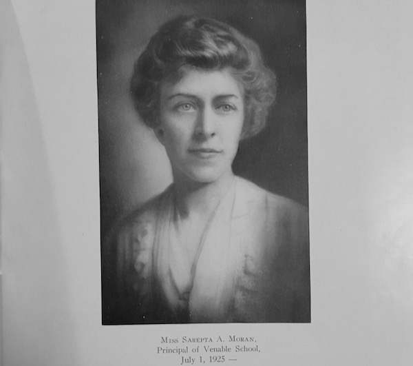
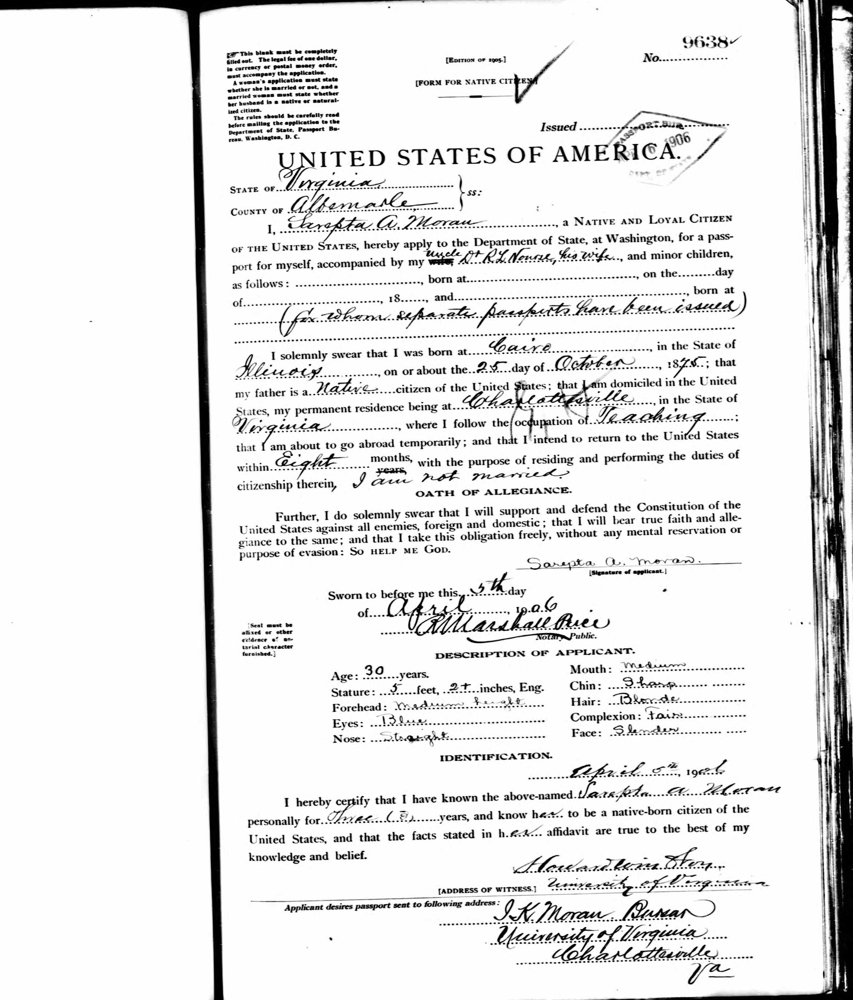
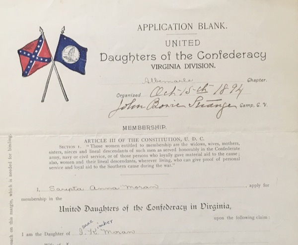
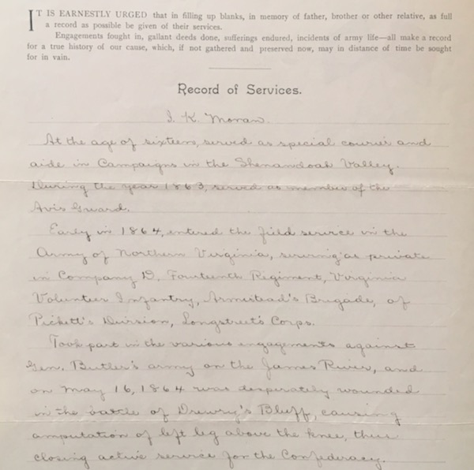
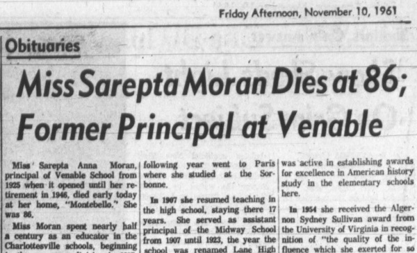
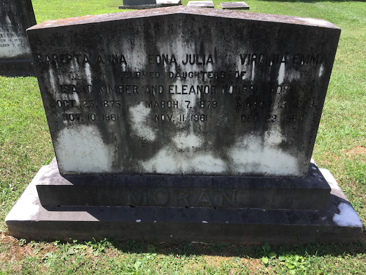

## Introduction

Sarepta Anna Moran​ (1875-1961) was an educator in Charlottesville schools from 1897 until her retirement in 1945. She was the first principal of Venable Elementary when it opened in 1925, and served in that role for 21 years. Note that Moran’s given name is frequently misspelled "Serepta."

In 1924, the Midway High School yearbook was dedicated to her "high ideals, true sense of justice, refined culture and sincere devotion to her work," along with the photo of her below.

Moran was born in Cairo, Illinois. She received a Master’s degree from Wesleyan Female Institute in Staunton, then became a teacher in Kentucky. In 1897, she began teaching in Charlottesville schools in the grammar division at Midway School, then moved to the high school division in 1905 to teach French and German. In 1906, she took a year of leave from teaching to study at the Sorbonne in Paris, and later did graduate work at Harvard, Columbia, and UVa. 

(*Moran's passport, 1906*)

From 1907 to 1923, she was assistant principal at Midway High, then became the first principal of Venable Primary (now Venable Elementary) when it opened in 1925, staying there until her retirement in 1946. In 1954, she received the Algernon Sydney Sullivan Award from UVA for her contributions as an educator.

(*Sarepta Moran UDC Application, Special Collections, University of Virginia Library*)

Moran was active in the Albemarle chapters of both the Daughters of the American Revolution (DAR) and the United Daughters of the Confederacy (UDC). The UDC was one of the most effective organizations at propagating the ["Lost Cause" myth](https://www.encyclopediavirginia.org/lost_cause_the), which sought so present an ahistorical view that the Civil War was not about the economic interest of slavery and the political interest of white supremacy.  The Albemarle chapter was instrumental in erecting several Confederate monuments in downtown Charlottesville, including the statue ​*At the Ready* at the Albemarle County Courthouse, the *Robert Edward Lee​* equestrian statue, and the *T​homas Jonathan Jackson* ("Stonewall Jackson") statue. 

One of the most notorious tactics of promoting the Lost Cause revision of factual history was through the [writing and selection of school textbooks](https://www.encyclopediavirginia.org/United_Daughters_of_the_Confederacy#its3). First as a teacher and later as principal, Moran held a uniquely effective role in this historical activism. 

(*Sarepta Moran UDC Application, Special Collections, University of Virginia Library*)

Moran joined the UDC in 1906 based on her status as a "true daughter" of the Confederacy, as her father, Isaac K. Moran, has served in the Confederate States Army. I. K. Moran, began service to the Confederate cause at age 16, prior to being old enough to be a soldier, then enlisted in 1864 when the age limit was lowered to 17. Isaac K. Moran fought in Gen. Robert E. Lee's Army of Northern Virginia and was "desperately wounded in the battle of Drewry's Bluff, causing amputation of left leg above the knee." I. K. Moran served as bursar of UVA from an unknown date until 1912.

For most of her adult life, Moran lived with her two sisters, Edna and Virginia, and their parents until their deaths, at 215 Montebello Circle, known as "[Montebello](https://en.wikipedia.org/wiki/Montebello_\(Charlottesville,_Virginia\))", now 1700 Stadium Road. None of the three sisters married. [Col. Charles S. Venable](../charles-venable), for whom Venable Elementary School is named, owned the house from 1875-1887, and it was later purchased in 1914 as the "Montebello Mansion House" by Moran’s father.

## References

* [104-0043 Montebello](https://www.dhr.virginia.gov/historic-registers/104-0043/), Virginia Department of Historic Resources
* Daily Progress, Nov. 10 1961, "Miss Sarepta Moran Dies at 86; Former Principal of Venable"